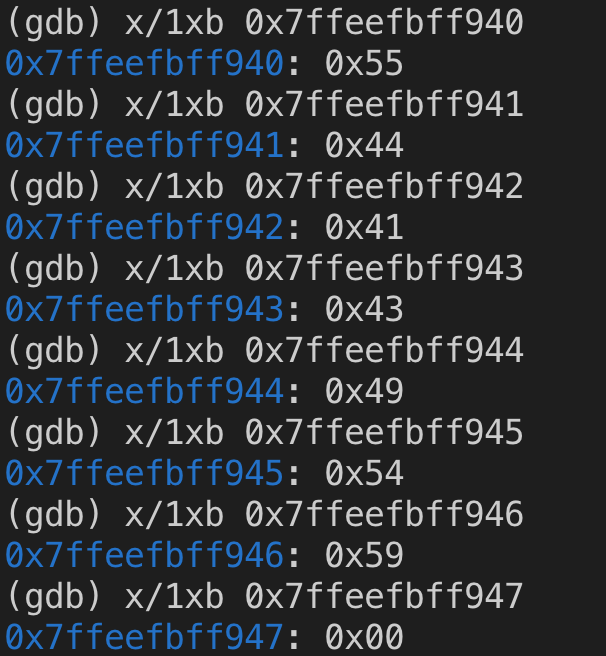
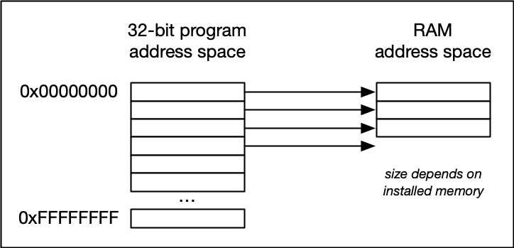
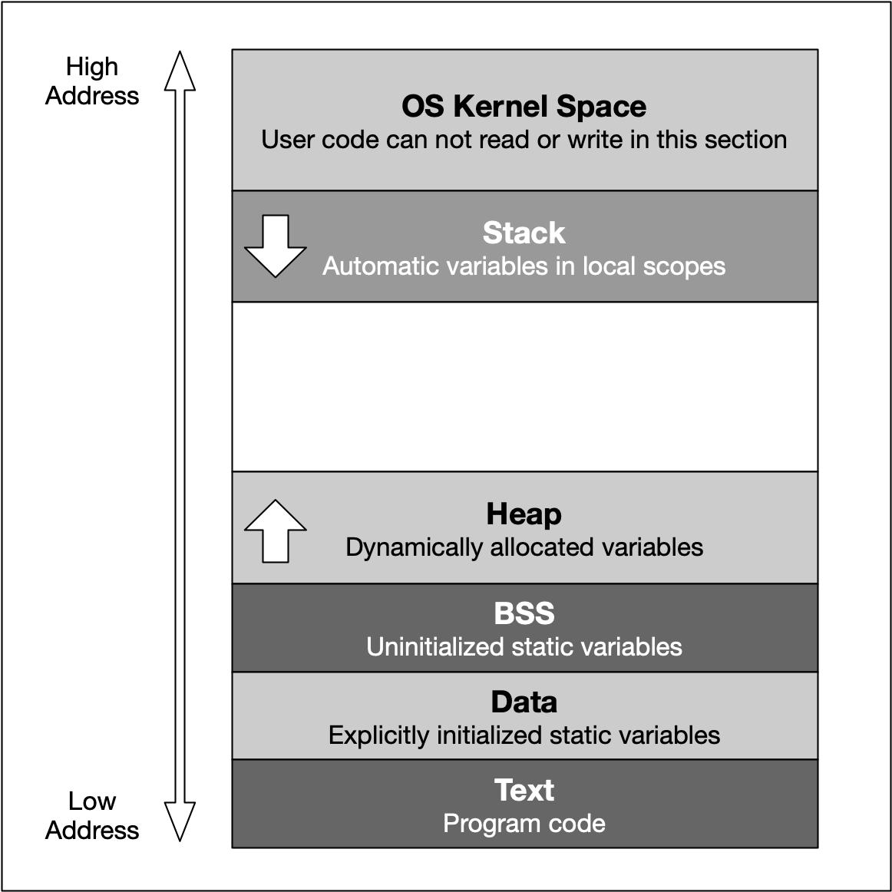
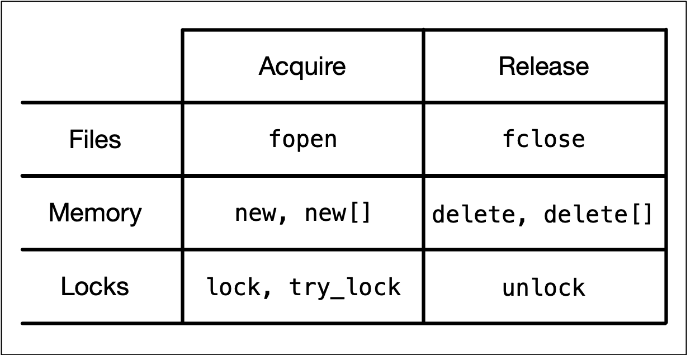

# Memory Management in CPP

## Outline

### 1. Overview of Memory Types

1. Memory Addresses and Hexadecimal Numbers
2. Using the Debugger to Analyze Memory
3. Types of Computer Memory
4. Cache Memory
5. Virtual Memory

### 2. Variables and Memory

1. The Process Memory Model
2. Automatic Memory Allocation (The Stack)
3. Call-By-Value vs. Call-By-Reference

### 3.Dynamic Memory Allocation (The Heap)

1. Heap Memory
2. Using malloc and free
3. Using new and delete
4. Typical Memory Management Problems

### 4.Resource Copying Policies

1. Copy Semantics
2. Lvalues and rvalues
3. Move Semantics

### 5. Smart Pointers

1. Resource Acquisition Is Initialization (RAII)
2. Smart pointers
3. Transferring ownership

### 6. Project: Memory Management Chatbot


## 1. Overview of Memory Types

### Memory Addresses and Hexadecimal Numbers

Understanding the number system used by computers to store and process data is essential for effective memory management, which is why we will start with an introduction into the binary and hexadecimal number systems and the structure of memory addresses.

Early attempts to invent an electronic computing device met with disappointing results as long as engineers and computer scientists tried to use the decimal system. One of the biggest problems was the low distinctiveness of the individual symbols in the presence of [noise(opens in a new tab)](https://en.wikipedia.org/wiki/Noise_(electronics)). A 'symbol' in our alphabet might be a letter in the range A-Z while in our decimal system it might be a number in the range 0-9. The more symbols there are, the harder it can be to differentiate between them, especially when there is electrical interference. After many years of research, an early pioneer in computing, John Atanasoff, proposed to use a coding system that expressed numbers as sequences of only two digits: one by the presence of a charge and one by the absence of a charge. This numbering system is called Base 2 or binary and it is represented by the digits 0 and 1 (called 'bit') instead of 0-9 as with the decimal system. Differentiating between only two symbols, especially at high frequencies, was much easier and more robust than with 10 digits. In a way, the ones and zeroes of the binary system can be compared to Morse Code, which is also a very robust way to transmit information in the presence of much interference. This was one of the primary reasons why the binary system quickly became the standard for computing.

Inside each computer, all numbers, characters, commands and every imaginable type of information are represented in binary form. Over the years, many coding schemes and techniques were invented to manipulate these 0s and 1s effectively. One of the most widely used schemes is called ASCII (*American Standard Code for Information Interchange*), which lists the binary code for a set of 127 characters. The idea was to represent each letter with a sequence of binary numbers so that storing texts on in computer memory and on hard (or floppy) disks would be possible.

The film enthusiasts among you might know the scene in the hit movie "The Martian" with Mat Daemon, in which an ASCII table plays an important role in the rescue from Mars.

The following figure shows an ASCII table, where each character (rightmost column) is associated with an 8-digit binary number:


In addition to the decimal number (column "Dec") and the binary number, the ASCII table provides a third number for each character (column "Hex"). According to the table above, the letter `z` is referenced by the decimal number `122`, by the binary number `0111 1010` and by `7A`. You have probably seen this type of notation before, which is called "*hexadecimal*". Hexadecimal (hex) numbers are used often in computer systems, e.g for displaying memory readouts - which is why we will look into this topic a little bit deeper. Instead of having a base of 2 (such as binary numbers) or a base of 10 (such as our conventional decimal numbers), hex numbers have a base of 16. The conversion between the different numbering systems is a straightforward operation and can be easily performed with any scientific calculator. More details on how to do this can e.g. be found [here(opens in a new tab)](https://en.wikipedia.org/wiki/Computer_number_format).

There are several reasons why it is preferable to use hex numbers instead of binary numbers (which computers store at the lowest level), three of which are given below:

1. **Readability**: It is significantly easier for a human to understand hex numbers as they resemble the decimal numbers we are used to. It is simply not intuitive to look at binary numbers and decide how big they are and how they relate to another binary number.
2. **Information density**: A hex number with two digits can express any number from 0 to 255 (because 16^2 is 256). To do the same in the binary system, we would require 8 digits. This difference is even more pronounced as numbers get larger and thus harder to deal with.
3. **Conversion into bytes**: Bytes are units of information consisting of 8 bits. Almost all computers are byte-addressed, meaning all memory is referenced by byte, instead of by bit. Therefore, using a counting system that can easily convert into bytes is an important requirement. We will shortly see why grouping bits into a byte plays a central role in understanding how computer memory works.

The reason why early computer scientists have decided to not use decimal numbers can also be seen in the figure below. In these days (before pocket calculators were widely available), programers had to interpret computer output in their head on a regular basis. For them, it was much easier and quicker to look at and interpret `7E`instead of `0111 1110`. Ideally, they would have used the decimal system, but the conversion between base 2 and base 10 is much harder than between base 2 and base 16. Note in the figure that the decimal system's digit transitions never match those of the binary system. With the hexadecimal system, which is based on a multiple of 2, digit transitions match up each time, thus making it much easier to convert quickly between these numbering systems.


Each dot represents an increase in the number of digits required to express a number in different number systems. For base 2, this happens at 2, 4, 8, 32, 64, 128 and 256. The red dots indicate positions where several numbering systems align. Note that there are breaks in the number line to conserve space.

>The key to converting between binary and hexadecimal is understanding their direct relationship: **1 hexadecimal digit equals 4 binary digits**. This makes the conversion process simple and efficient.
>
>1. Binary to Hexadecimal:
>
>   - **Group in Fours**: Start from the rightmost binary digit and group the bits into sets of 4. If the leftmost group has fewer than 4 bits, pad it with leading zeros.
>
>   - **Convert Each Group**: Use a conversion table or memorize the binary-to-hex mapping:
>
>     ```
>     Binary | Hex
>     0000   | 0
>     0001   | 1
>     0010   | 2
>     0011   | 3
>     0100   | 4
>     0101   | 5
>     0110   | 6
>     0111   | 7
>     1000   | 8
>     1001   | 9
>     1010   | A
>     1011   | B
>     1100   | C
>     1101   | D
>     1110   | E
>     1111   | F
>     ```
>
>   - **Example**: Convert binary `11010111` to hexadecimal:
>
>     1. Group: `1101 0111`
>
>     2. Convert: `1101 = D`, `0111 = 7`
>
>     3. Result: `D7`
>
>2. Hexadecimal to Binary:
>
>   - **Expand Each Digit**: Replace each hexadecimal digit with its corresponding 4-bit binary equivalent using the same conversion table.
>
>   - **Combine the Groups**: Write out the binary values for all digits in sequence.
>   - **Example**: Convert hexadecimal `3F` to binary:
>     - Expand: `3 = 0011`, `F = 1111`
>     - Combine: `0011 1111`
>     - Result: `00111111`
>
>3. Tips for Quick Conversion:
>
>   - Memorize the binary equivalents of common hex digits (e.g., `A = 1010`, `F = 1111`).
>
>   - Always group binary numbers in sets of 4 for hexadecimal conversion.
>
>   - Use leading zeros to ensure each hex digit has exactly 4 binary bits.
>
>
>4. Practical Applications:
>
>   - Hexadecimal is often used to represent large binary numbers in a compact form (e.g., memory addresses, machine code, color codes in web design).
>
>   - Understanding this conversion is essential for debugging, low-level programming, and working with computer systems.
>


### Using the Debugger to Analyze Memory

As you have seen in the last section, binary numbers and hex numbers can be used to represent information. A coding scheme such as an ASCII table makes it possible to convert text into binary form. In the following, we will try to look at computer memory and locate information there.

In the following example, we will use the debugger to look for a particular string in computer memory. Depending on your computer operating system and on the compiler you have installed, there might be several debugging tools available to you. In the following video, we will use the gdb debugger to locate the character sequence "UDACITY" in computer memory. The code below creates an array of characters in computer memory (on the stack, which we will learn more about shortly) and prints it to the console:

```c
#include <stdio.h>


int main()
{
    char str1[]= "UDACITY";
    printf("%s",str1);

    return 0;
}
```

Let us try to locate the string in memory using gdb.

A debugger is a powerful tool used not only for setting breakpoints but also for inspecting the values of variables. Depending on your development environment, you likely already have some kind of debugger installed on your system. In this tutorial, we will focus on the **GNU Debugger (GDB)**, a command-line-based tool. While GDB does not provide a graphical user interface (GUI), it offers a wealth of detailed information that can be extremely useful for debugging.

In this example, we will use GDB to examine computer memory directly. Specifically, we will locate a string in memory, represented in hexadecimal and binary values, and interpret it using an ASCII table.

#### Starting GDB
To begin using GDB, follow these steps:

1. Open your terminal or console.

2. Type the command `gdb` followed by the location of the executable file you want to debug. For example:

   ```bash
   g++ -g example.cpp -o example
   gdb example
   ```

When GDB starts, it will display information about your system and the debugger configuration. For instance, it may show details about your machine (e.g., an Ubuntu 15.0.50.20240403-0ubuntu1 system) and indicate that GDB has read the symbols (source code) associated with the program.

#### Viewing the Source Code
Once GDB is running, you can view the source code of your program by typing the `list` command:
```
list
```
This will display the source code in the debugging console.

#### Setting a Breakpoint
To halt the program's execution at a specific line, you can set a breakpoint. A breakpoint allows you to pause the program and inspect its state at that point. To set a breakpoint:

1. Identify the line number where you want to pause execution. For example, in this tutorial, we will set a breakpoint at **line 5**, where the string "UDACITY" is written into memory.
2. Use the `break` command followed by the line number:
   ```
   break 5
   ```
   GDB will confirm that a breakpoint has been set at the specified memory address corresponding to the line.

#### Running the Program
After setting a breakpoint, you need to run the program to reach the breakpoint. Use the `run` command:
```
run
```
When the program execution reaches the breakpoint, GDB will pause and display a message indicating that the breakpoint has been hit. For example:
```
Breakpoint 1, main () at example.cpp:5
```
This means the program is paused at line 5, which is about to be executed.

#### Executing the Next Line
To execute the next line of code, use the `step` command:
```
step
```
This will move the program execution to the next line. In this case, after executing line 5, the string "UDACITY" will be written into memory.

#### Inspecting Variables or Address
Once the program is paused, you can inspect variables and their memory addresses:

1. To print the value of a variable, use the `print` (or `p`) command followed by the variable name. For example:
   ```
   print str1
   ```
   This will display the content of the variable `str1`, which contains the string "UDACITY".

2. To print the memory address of the variable, use the `print` command with the `&` operator:
   ```
   print &str1
   ```
   This will display the memory address where the **first character** of the string is stored.
   
   ```
   (char (*)[8]) 0x7fffffffd450
   ```
   
   In memory, the characters of the string (e.g., "U", "D", "A", etc.) are stored sequentially. By examining the memory address of the first character, you can locate the subsequent characters in memory.
   
   


#### View Memory by `x` Command
To view memory in a program, we use the `x` command. While it may seem intimidating at first due to its parameters, it is a powerful tool for accessing and formatting memory data.

The `x` command uses several parameters to define how memory is accessed and displayed. Let’s break them down:

- **`n` (Number of Units):**  
  This parameter specifies the number of memory units to print. For example, if we want to print seven successive memory addresses, `n` will be set to `7`.

- **`f` (Format):**  
  This parameter determines how the memory content is displayed. Common formats include:
  - Binary (`t`): Displays data as binary integers (0s and 1s).
  - Hexadecimal (`x`): Displays data in hexadecimal format.

- **`u` (Unit Size):**  
  This parameter specifies the size of each memory unit. For example:
  - `b`: Byte (8 bits).

#### Printing Memory in Binary
Let’s walk through an example where we print the memory content of the string "Udacity" in binary format.

1. **Determine the Number of Units (`n`):**  
   The string "Udacity" has 7 characters, so we set `n = 7`.

2. **Set the Format (`f`):**  
   To display the memory in binary, we use `t`.

3. **Set the Unit Size (`u`):**  
   We choose `b` to print each memory unit as a byte.

4. **Specify the Memory Address:**  
   The memory address of the string is `0x7ffeefbff940`.

5. **Enter the Command:**  
   
   ```
   x/7tb 0x7ffeefbff940
   ```
   
6. **Output:**  
   The command prints seven successive bytes in binary format. Each group of 8 bits (1 byte) corresponds to a character in the string. For example:
   
   - The binary representation of the first byte corresponds to the letter `U` in the ASCII table.
   
   ```
   0x7ffeefbff940: 01010101        01000100        01000001        01000011        01001001        01010100        01011001
   ```
   
   Using the ASCII table, you can map the binary output to characters. For the string "Udacity," the binary data corresponds to:
   
   - `U`, `D`, `A`, `C`, `I`, `T`, `Y`.
   

#### Printing Memory in Hexadecimal
To display the same memory content in hexadecimal format, simply change the format parameter from `t` (binary) to `x` (hexadecimal). For example:

1. **Command:**  

   ```
   x/7xb 0x7ffeefbff940
   ```

2. **Output:**  
   The memory content is now displayed in hexadecimal format, making it easier to read and interpret.

   ```
   0x7ffeefbff940: 0x55    0x44    0x41    0x43    0x49    0x54    0x59
   ```

   You can clearly see that using hex numbers to display the information is a **much shorter and more convenient** form for a human programmer than looking at the binary numbers. Note that **hex numbers are usually prepended with "0x"**.

Let us perform a short experiment using `gdb` again: By adding 1, 2, 3, … to the address of the string variable `str1`, we can proceed to the next cell until we reach the end of the memory we want to look at.




#### **Summary**

While working with GDB, it can be helpful to have a [cheat sheet](./assets/gdb_cheat_sheet.pdf) of common commands. For example:

- `break <line>`: Set a breakpoint at a specific line.
- `run`: Start the program.
- `step`: Execute the next line of code.
- `print <variable>`: Display the value of a variable.
- `print &<variable>`: Display the memory address of a variable.
- `delete`: Remove all breakpoints.
- `disable <breakpoint>`: Disable a specific breakpoint.

Using the `x` command, you can explore memory in various formats. Here’s a quick recap:
- Convert information into binary or hexadecimal form.
- Store the information at a specific memory address.
- Use the `x` command to access and format the memory content.


### Types of Computer Memory

In a course on memory management we obviously need to take a look at the available memory types in computer systems. Below you will find a small list of some common memory types that you will surely have heard of:

- RAM / ROM
- Cache (L1, L2)
- Registers
- Virtual Memory
- Hard Disks, USB drives

Let us look into these types more deeply: When the CPU of a computer needs to access memory, it wants to do this with **minimal latency**. Also, as large amounts of information need to be processed, **the available memory should be sufficiently large with regard to the tasks we want to accomplish.**

Regrettably though, **low latency and large memory are not compatible with each other** (at least not at a reasonable price). In practice, the decision for low latency usually results in a reduction of the available storage capacity (and vice versa). This is the reason why a computer has multiple memory types that are arranged hierarchically. The following pyramid illustrates the principle:


As you can see, the **CPU** and its ultra-fast (but small) **registers** used for **short-term data storage** reside at the top of the pyramid. Below are **Cache and RAM**, which belong to the category of **temporary memory** which quickly looses its content once power is cut off. Finally, there are **permanent storage devices such as the ROM**, hard drives as well as removable drives such as USB sticks.

Let us take a look at a typical computer usage scenario to see how the different types of memory are used:

1. After switching on the computer, it loads data from its read-only memory (ROM) and performs a power-on self-test (POST) to ensure that all major components are working properly. Additionally, the computer memory controller checks all of the memory addresses with a simple read/write operation to ensure that memory is functioning correctly.
2. After performing the self-test, the computer loads the basic input/output system (BIOS) from ROM. The major task of the BIOS is to make the computer functional by providing basic information about such things as storage devices, boot sequence, security or auto device recognition capability.
3. The process of activating a more complex system on a simple system is called "bootstrapping": It is a solution for the chicken-egg-problem of starting a software-driven system by itself using software. During bootstrapping, the computer loads the operating system (OS) from the hard drive into random access memory (RAM). RAM is considered "random access" because any memory cell can be accessed directly by intersecting the respective row and column in the matrix-like memory layout. For performance reasons, many parts of the OS are kept in RAM as long as the computer is powered on.
4. When an application is started, it is loaded into RAM. However, several application components are only loaded into RAM on demand to preserve memory. Files that are opened during runtime are also loaded into RAM. When a file is saved, it is written to the specified storage device. After closing the application, it is deleted from RAM.

This simple usage scenario shows the central importance of the RAM. Every time data is loaded or a file is opened, it is placed into this temporary storage area - but what about the other memory types above the RAM layer in the pyramid?


To maximize CPU performance, fast access to large amounts of data is critical. If the CPU cannot get the data it needs, it stops and waits for data availability. Thus, when designing new memory chips, engineers must adapt to the speed of the available CPUs. The problem they are facing is that memory which is able to keep up with modern CPUs running at several GHz is extremely expensive. To combat this, computer designers have created the memory tier system which has already been shown in the pyramid diagram above. The solution is to use expensive memory in small quantities and then back it up using larger quantities of less expensive memory.

The cheapest form of memory available today is the hard disk. It provides large quantities of inexpensive and permanent storage. The problem of a hard disk is its comparatively low speed - even though access times with modern solid state disks (SSD) have decreased significantly compared to older magnetic-disc models.

The next hierarchical level above hard disks or other external storage devices is the RAM. We will not discuss in detail how it works but only take a look at some key performance metrics of the CPU at this point, which place certain performance expectations on the RAM and its designers:

1. The **bit size** of the CPU decides how many bytes of data it can access in RAM memory at the same time. A 16-bit CPU can access 2 bytes (with each byte consisting of 8 bit) while a 64-bit CPU can access 8 bytes at a time.
2. The **processing speed** of the CPU is measured in Gigahertz or Megahertz and denotes the number of operations it can perform in one second.

From processing speed and bit size, the data rate required to keep the CPU busy can easily be computed by multiplying bit size with processing speed. With modern CPUs and ever-increasing speeds, the available RAM in the market will not be fast enough to match the CPU data rate requirements.


### Cache Memory

#### Cache Levels

Cache memory is much faster but also significantly smaller than standard RAM. It holds the data that will (or might) be used by the CPU more often. In the memory hierarchy we have seen in the last section, the cache plays an intermediary role between fast CPU and slow RAM and hard disk. The figure below gives a rough overview of a typical system architecture:


System architecture diagram showing caches, ALU (arithmetic logic unit), main memory, and the buses connected each component.

The central CPU chip is connected to the outside world by a number of buses. There is a cache bus, which leads to a block denoted as L2 cache, and there is a system bus as well as a memory bus that leads to the computer main memory. The latter holds the comparatively large RAM while the L2 cache as well as the L1 cache are very small with the latter also being a part of the CPU itself.

The concept of L1 and L2 (and even L3) cache is further illustrated by the following figure, which shows a multi-core CPU and its interplay with L1, L2 and L3 caches:


L1, L2, and L3 cache

1. **Level 1 cache** is the fastest and smallest memory type in the cache hierarchy. In most systems, the L1 cache is not very large. Mostly it is in the range of 16 to 64 kBytes, where the memory areas for instructions and data are separated from each other (L1i and L1d, where "i" stands for "instruction" and "d" stands for "data". Also see "[Harvard architecture(opens in a new tab)](https://en.wikipedia.org/wiki/Harvard_architecture)" for further reference). The importance of the L1 cache grows with increasing speed of the CPU. In the L1 cache, the most frequently required instructions and data are buffered so that as few accesses as possible to the slow main memory are required. This cache avoids delays in data transmission and helps to make optimum use of the CPU's capacity.
2. **Level 2 cache** is located close to the CPU and has a direct connection to it. The information exchange between L2 cache and CPU is managed by the L2 controller on the computer main board. The size of the L2 cache is usually at or below 2 megabytes. On modern multi-core processors, the L2 cache is often located within the CPU itself. The choice between a processor with more clock speed or a larger L2 cache can be answered as follows: With a higher clock speed, individual programs run faster, especially those with high computing requirements. As soon as several programs run simultaneously, a larger cache is advantageous. Usually normal desktop computers with a processor that has a large cache are better served than with a processor that has a high clock rate.
3. **Level 3 cache** is shared among all cores of a multicore processor. With the L3 cache, the [cache coherence(opens in a new tab)](https://en.wikipedia.org/wiki/Cache_coherence) protocol of multicore processors can work much faster. This protocol compares the caches of all cores to maintain data consistency so that all processors have access to the same data at the same time. The L3 cache therefore has less the function of a cache, but is intended to simplify and accelerate the cache coherence protocol and the data exchange between the cores.

On Mac, information about the system cache can be obtained by executing the command `sysctl -a hw` in a terminal. On Debian Linux linux, this information can be found with `lscpu | grep cache`. On my iMac Pro (2017), this command yielded (among others) the following output:

```
hw.memsize: 34359738368
hw.l1icachesize: 32768
hw.l1dcachesize: 32768
hw.l2cachesize: 1048576
hw.l3cachesize: 14417920
```

- *hw.l1icachesize* is the size of the L1 instruction cache, wich is at 32kB. This cache is strictly reserved for storing CPU instructions only.
- *hw.l1dcachesize* is also 32 KB and is dedicated for data as opposed to instructions.
- *hw.l2cachesize* and *hw.l3cachesize* show the size of the L2 and L3 cache, which are at 1MB and 14MB respectively.

It should be noted that the size of all caches combined is very small when compared to the size of the main memory (the RAM), which is at 32GB on my system.

Ideally, data needed by the CPU should be read from the various caches for more than 90% of all memory access operations. This way, the high latency of RAM and hard disk can be efficiently compensated.

#### Temporal and Spatial Locality

The following table presents a rough overview of the latency of various memory access operations. Even though these numbers will differ significantly between systems, the order of magnitude between the different memory types is noteworthy. While L1 access operations are close to the speed of a photon traveling at light speed for a distance of 1 foot, the latency of L2 access is roughly one order of magnitude slower already while access to main memory is two orders of magnitude slower.


Originally from Peter Norvig: [http://norvig.com/21-days.html#answers(opens in a new tab)](http://norvig.com/21-days.html#answers)

In algorithm design, programmers can exploit two principles to increase runtime performance:

1. **Temporal locality** means that address ranges that are accessed are likely to be used again in the near future. In the course of time, the same memory address is accessed relatively frequently (e.g. in a loop). This property can be used at all levels of the memory hierarchy to keep memory areas accessible as quickly as possible.
2. **Spatial locality** means that after an access to an address range, the next access to an address in the immediate vicinity is highly probable (e.g. in arrays). In the course of time, memory addresses that are very close to each other are accessed again multiple times. This can be exploited by moving the adjacent address areas upwards into the next hierarchy level during a memory access.


#### Example: Cache-friendly coding

Let us consider the following code example:

we'll explore a simple program with an inner and outer loop. Inside this nested loop, we can access an array using different loop indices. Understanding cache, its structure, and the structure of data in memory helps us design more cache-friendly code, significantly speeding up our programs.

We start by including two libraries:
1. `chrono`: For time measurement and formatting.
2. `iostream`: For input and output operations.

```cpp
int main() {
    // Create a 4x4 static integer array
    int size = 4;
    int x[4][4];

    // Record the current time
    auto t1 = std::chrono::high_resolution_clock::now();

    // Nested loop
    for (int i = 0; i < size; i++) {
        for (int j = 0; j < size; j++) {
            // Write the result of i+j into the array
            x[j][i] = i + j;
        }
    }

    // Output the addresses and indices of the array
    for (int i = 0; i < size; i++) {
        for (int j = 0; j < size; j++) {
            std::cout << "&x[" << j << "][" << i << "] = " << &x[j][i] << " ";
            std::cout << "i = " << i << ", j = " << j << std::endl;
        }
    }

    // Record the end time and calculate execution time
    auto t2 = std::chrono::high_resolution_clock::now();
    auto duration = std::chrono::duration_cast<std::chrono::microseconds>(t2 - t1).count();
    std::cout << "Execution time: " << duration << " microseconds" << std::endl;

    return 0;
}
```

**Code Analysis**

1. **Array Initialization**: We create a 4x4 static integer array, totaling 16 elements.
2. **Time Recording**: Use the `chrono` library's high-resolution clock to record the current time.
3. **Nested Loop**: The outer and inner loops use variables `i` and `j`, ranging from 0 to `size-1`. Inside the inner loop, we write the result of `i+j` into the array.
4. **Address Output**: Use `cout` to output the address of each element in the array along with its indices.
5. **Execution Time Calculation**: Record the time again, compute the difference between two time points, and output it in microseconds.

**Experiment Results**

- **Initial Array**: Execution time is about 98 microseconds (including printing).
- **Without Printing**: Execution time is close to 0 microseconds.
- **Increased Array Size**: With 1000x1000 elements (one million integers), execution time is about 3349 microseconds.

**Performance Optimization**

By commenting out the output statements, we can see a significant reduction in execution time, indicating that printing is a slow operation. Further optimization can be achieved by rearranging loop indices (e.g., swapping `i` and `j`) to improve cache friendliness.

After interchanging the index `i` and `j` when accessing the variable `x`, the resulting runtime performance compared to the original version.

```bash
# x[i][j] = i + j;
Execution time: 55438 microseconds
```

```bash
# x[j][i] = i + j;
Execution time: 84259 microseconds
```

Depending on the machine used for executing the two code versions, there will be a huge difference in execution time. In order to understand why this happens, let us revisit the memory layout we investigated with the `gdb` debugger at the beginning of this lesson: **Even though we have created a two-dimensional array, it is stored in a one-dimensional succession of memory cells**. In our minds, the array will (probably) look like this:


In memory however, it is stored as a single line as follows:


```bash
(gdb) x/4tb 0x555555558160
0x555555558160 <_ZZ4mainE1x>:   00000000        00000000        00000000        00000000
(gdb) 
0x555555558164 <_ZZ4mainE1x+4>: 00000000        00000000        00000000        00000000
(gdb) 
0x555555558168 <_ZZ4mainE1x+8>: 00000000        00000000        00000000        00000000
(gdb) 
0x55555555816c <_ZZ4mainE1x+12>:        00000000        00000000        00000000        00000000
(gdb) 
0x555555558170 <_ZZ4mainE1x+16>:        00000001        00000000        00000000        00000000
(gdb) 
0x555555558174 <_ZZ4mainE1x+20>:        00000000        00000000        00000000        00000000
(gdb) 
0x555555558178 <_ZZ4mainE1x+24>:        00000000        00000000        00000000        00000000
(gdb) 
0x55555555817c <_ZZ4mainE1x+28>:        00000000        00000000        00000000        00000000
(gdb) 
0x555555558180 <_ZZ4mainE1x+32>:        00000000        00000000        00000000        00000000
(gdb) 
0x555555558184 <_ZZ4mainE1x+36>:        00000000        00000000        00000000        00000000
(gdb) 
0x555555558188 <_ZZ4mainE1x+40>:        00000000        00000000        00000000        00000000
(gdb) 
0x55555555818c <_ZZ4mainE1x+44>:        00000000        00000000        00000000        00000000
(gdb) 
0x555555558190 <_ZZ4mainE1x+48>:        00000000        00000000        00000000        00000000
(gdb) 
0x555555558194 <_ZZ4mainE1x+52>:        00000000        00000000        00000000        00000000
(gdb) 
0x555555558198 <_ZZ4mainE1x+56>:        00000000        00000000        00000000        00000000
(gdb) 
0x55555555819c <_ZZ4mainE1x+60>:        00000000        00000000        00000000        00000000
```

> For each integer, we store it using 4 bytes (each byte consists of 8 bits). Therefore, as shown above, each address corresponds to 32 bits (`00000000        00000000        00000000        00000000`). Additionally, as you can observe, in memory, the data is actually stored sequentially.

As can be seen, the rows of the two-dimensional matrix are copied one after the other. This format is called "**row major**" and is the **default for both C and C++**. **Some other languages such as Fortran are "column major"** and a memory-aware programmer should always know the memory layout of the language he or she is using.

Note that even though the row major memory layout is used in C++, this doesn't mean that all C++ libraries have the same default; for example, **the popular Eigen library** used for matrix operations in C++ **[defaults to column major](https://eigen.tuxfamily.org/dox/group__TopicStorageOrders.html).**

As we have created an array of integers, the difference between **two adjacent memory cells will be `sizeof(int)`, which is 4 bytes**. Let us verify this by changing the size of the array to 4x4 and by plotting both the address and the index numbers to the console. Be sure to revert the array access back to `x[i][j] = i + j`. You can plot by uncommenting the printout line in the inner for loop:

```
0x6021e0: i=0, j=0
0x6021e4: i=0, j=1
0x6021e8: i=0, j=2
0x6021ec: i=0, j=3

0x6021f0: i=1, j=0
0x6021f4: i=1, j=1
0x6021f8: i=1, j=2
0x6021fc: i=1, j=3

0x602200: i=2, j=0
0x602204: i=2, j=1
0x602208: i=2, j=2
0x60220c: i=2, j=3

0x602210: i=3, j=0
0x602214: i=3, j=1
0x602218: i=3, j=2
0x60221c: i=3, j=3

Execution time: 83 microseconds
```

Clearly, the difference between two inner loop cycles is at 4 as predicted. When we interchange the indices `i` and `j` when accessing the array as

```cpp
x[j][i] = i + j;
std::cout << &x[j][i] << ": i=" << j << ", j=" << i << std::endl;
```

we get the following output:

```
0x6021e0: i=0, j=0
0x6021f0: i=1, j=0
0x602200: i=2, j=0
0x602210: i=3, j=0

0x6021e4: i=0, j=1
0x6021f4: i=1, j=1
0x602204: i=2, j=1
0x602214: i=3, j=1

0x6021e8: i=0, j=2
0x6021f8: i=1, j=2
0x602208: i=2, j=2
0x602218: i=3, j=2

0x6021ec: i=0, j=3
0x6021fc: i=1, j=3
0x60220c: i=2, j=3
0x60221c: i=3, j=3

Execution time: 115 microseconds
```

As can be see, the difference between two rows is now 0x10, which is 16 in the decimal system. **This means that with each access to the matrix, four memory cells are skipped** and **the principle of spatial locality is violated**. As a result, the wrong data is loaded into the L1 cache, leading to cache misses and costly reload operations - hence the significantly increased execution time between the two code samples. The difference in execution time of both code samples shows that cache-aware programming can increase code performance significantly.


#### Summary

1. **Purpose of Cache Memory**: **Cache memory is used to speed up data access** for the CPU by storing frequently accessed data and instructions, reducing the need to access slower main memory (RAM).
2. **Memory Hierarchy**: The video explains that computer memory is organized in a hierarchy, with cache memory acting as an intermediary between fast CPU registers and slower main memory.
3. **Locality Principles**: It introduces two important principles:
   - **Temporal Locality**: Recently accessed data is likely to be accessed again soon.
   - **Spatial Locality**: Data near recently accessed data is likely to be accessed soon.
4. **Impact on Performance**: optimizing code to be cache-friendly can lead to significant performance improvements, as even small changes in code structure can greatly affect how data is cached.

### Virtual Memory

#### Problems with physical memory

Virtual memory is a very useful concept in computer architecture because it helps with making your software work well given the configuration of the respective hardware on the computer it is running on.

The idea of virtual memory stems back from a (not so long ago) time, when the random access memory (RAM) of most computers was severely limited. Programmers needed to treat memory as a precious resource and use it most efficiently. Also, they wanted to be able to run programs even if there was not enough RAM available. At this time, the amount of RAM is no longer a large concern for most computers and programs usually have enough memory available to them. **But in some cases, for example when trying to do video editing or when running multiple large programs at the same time, the RAM memory can be exhausted**. In such a case, the computer can slow down drastically.

There are several other memory-related problems, that programmers need to know about:

1. **Holes in address space** : If several programs are started one after the other and then shortly afterwards some of these are terminated again, it must be ensured that the freed-up space in between the remaining programs does not remain unused. If memory becomes too fragmented, it might not be possible to allocate a large block of memory due to a large-enough free contiguous block not being available any more.
2. **Programs writing over each other** : If several programs are allowed to access the same memory address, they will overwrite each others' data at this location. In some cases, this might even lead to one program reading sensitive information (e.g. bank account info) that was written by another program. This problem is of particular concern when writing concurrent programs which run several threads at the same time.

The basic idea of virtual memory is **to separate the addresses a program may use from the addresses in physical computer memory**. By using a **mapping function**, an **access to (virtual) program memory can be redirected to a real address** which is guaranteed to be protected from other programs.

##### 32-bit Address Space Calculation

In a 32-bit system, memory addressing works as follows:
- Each address is represented by 32 binary digits (bits)
- Each bit can be either 0 or 1
- Total number of possible addresses = 2^32 = 4,294,967,296
- Since each address points to one byte:
  - Total bytes = 4,294,967,296 bytes
  - Converting to GB: 4,294,967,296 ÷ (1024 × 1024 × 1024) = 4 GB

Therefore, a 32-bit system has a maximum theoretical memory limit of 4 GB. This is a hard limit imposed by the architecture itself, which explains why 32-bit operating systems cannot utilize more than 4 GB of RAM, regardless of how much physical memory is installed.

##### 64-bit Address Space Calculation

For a 64-bit system, the calculation expands dramatically:
- Each address uses 64 binary digits
- Total possible addresses = 2^64 = 18,446,744,073,709,551,616
- Converting to larger units:
  - 2^64 bytes = 16 Exabytes (EB)
  - = 16,384 Petabytes (PB)
  - = 16,777,216 Terabytes (TB)
  - = 17,179,869,184 Gigabytes (GB)

While this is the theoretical limit, most modern systems implement 48-bit addressing, which still provides 256 TB of addressable space. This massive address space effectively removes memory addressing as a bottleneck in modern computing systems, making 64-bit architecture the standard for contemporary computers. The increase from 32-bit to 64-bit represents a 2^32-fold increase in addressing capability, which is why we moved away from 32-bit systems as memory requirements grew beyond 4 GB.

#### Expanding the available memory

As you have just see in 32-bit system, the total amount of addressable memory is limited and depends on the architecture of the system (e.g. 32-bit). But what would happen if the available physical memory was below the upper bound imposed by the architecture? The following figure illustrates the problem for such a case:



In the image above, the available physical memory is less than the upper bound provided by the 32-bit address space.

On a typical architecture such as MIPS ("Microprocessor without interlocked pipeline stages"), each program is promised to have access to an address space ranging from 0x00000000 up to 0xFFFFFFFF. If however, the available physical memory is only 1GB in size, a 1-on-1 mapping would lead to undefined behavior as soon as the 30-bit RAM address space were exceeded.

With virtual memory however, a mapping is performed between the virtual address space a program sees and the physical addresses of various storage devices such as the RAM but also the hard disk. Mapping makes it possible for the operating system to use physical memory for the parts of a process that are currently being used and back up the rest of the virtual memory to a secondary storage location such as the hard disk. With virtual memory, the size of RAM is not the limit anymore as the system hard disk can be used to store information as well.

The following figure illustrates the principle:


With virtual memory, the RAM acts as a cache for the virtual memory space which resides on secondary storage devices. On Windows systems, the file `pagefile.sys` is such a virtual memory container of varying size. To speed up your system, it makes sense to adjust the system settings in a way that this file is stored on an SSD instead of a slow magnetic hard drive, thus reducing the latency. On a Mac, swap files are stored in`/private/var/vm/`.

In a nutshell, virtual memory guarantees us a fixed-size address space which is largely independent of the system configuration. Also, the OS guarantees that the virtual address spaces of different programs do not interfere with each other.

The task of mapping addresses and of providing each program with its own virtual address space is performed entirely by the operating system, so from a programmer’s perspective, we usually don’t have to bother much about memory that is being used by other processes.

Before we take a closer look at an example though, let us define two important terms which are often used in the context of caches and virtual memory:

- A **memory page** is a number of directly successive memory locations in virtual memory defined by the computer architecture and by the operating system. The computer memory is divided into memory pages of equal size. The use of memory pages enables the operating system to perform virtual memory management. The entire working memory is divided into tiles and each address in this computer architecture is interpreted by the Memory Management Unit (MMU) as a logical address and converted into a physical address.
- A **memory frame** is mostly identical to the concept of a memory page with the key difference being its location in the physical main memory instead of the virtual memory.

The following diagram shows two running processes and a collection of memory pages and frames:


As can be seen, both processes have their own virtual memory space. Some of the pages are mapped to frames in the physical memory and some are not. If process 1 needs to use memory in the memory page that starts at address 0x1000, a page fault will occur if the required data is not there. The memory page will then be mapped to a vacant memory frame in physical memory. Also, note that the virtual memory addresses are not the same as the physical addresses. The first memory page of process 1, which starts at the virtual address 0x0000, is mapped to a memory frame that starts at the physical address 0x2000.

In summary, virtual memory management is performed by the operating system and programmers do usually not interfere with this process. The major benefit is a unique perspective on a chunk of memory for each program that is only limited in its size by the architecture of the system (32 bit, 64 bit) and by the available physical memory, including the hard disk.

#### Summary

**Virtual memory** is a fundamental concept that significantly **benefits programmers by abstracting away hardware-specific memory configurations**, allowing them to focus on writing and compiling code without concerning themselves with the underlying hardware details. While virtual memory provides this abstraction, it doesn't eliminate the need for cache optimization and careful memory management. Understanding the underlying memory structure remains valuable, especially when optimizing program performance.

One practical optimization technique involves relocating the **virtual swap file to faster storage media, such as a solid-state drive.** A **major advantage of virtual memory** is its **provision of contiguous address space for each program**, enabling the **division of memory into dedicated areas for specific purposes**. This segmentation allows for designated spaces for global variables and protected areas for program code, forming what is known as the Memory Model.

The C++ **Memory Model** is central to understanding memory management. It defines **how different memory areas are structured and accessed, including concepts like heap and stack.** This understanding is crucial for effective memory management and forms the foundation for advanced programming techniques. For programmers seeking to write efficient and reliable code, comprehending these memory concepts is essential, as they provide the tools needed for both basic programming tasks and advanced performance optimization.

This fundamental knowledge of memory structures, types, and virtual memory systems serves as a gateway to more complex topics in memory management, particularly in the context of C++ programming.


## 2. Variables and Memory

### The Process Memory Model

When a **program initializes, it receives its own dedicated block of virtual memory,** with capacity varying by system architecture - 4GB for 32-bit systems and effectively unlimited (16 exabytes) for 64-bit systems. The virtual memory space is organized into distinct areas, with programmers having access to four out of six regions for data storage, while the operating system manages the remainder.

The heap and stack emerge as the most crucial areas for programmers. **A fundamental responsibility of programmers is deciding how to utilize these memory regions effectively**, as heap and stack memory usage have significantly different implications. This forms the foundation of the C++ process memory model, which all programs must conform to.

The memory model's understanding is essential for proper memory management in C++ programming, particularly regarding the correct usage of both stack and heap memory. This knowledge serves as a prerequisite for more detailed exploration of memory management techniques in subsequent sections.

This **address space is arranged in a linear fashion** with one block of data being stored at each address. It is also divided into several distinct areas as illustrated by the figure below:


The last address `0cFFFFFFFF` converts to the decimal `4.294.967.295` , which is the total amount of memory blocks that can theoretically addressed in a 32 bit operating system - hence the well-known limit of 4GB of memory. On a **64 bit system**, the available space is significantly (!) larger. Also, the **addresses are stored with 8 bytes** instead of 4 bytes.

From a programming perspective though, **we are not able to use the entire address space**. Instead, the blocks "**OS Kernel Space" and "Text" are reserved** for the operating system. In **kernel space**, only the most trusted code is executed - it is **fully maintained by the operating system and serves as an interface between the user code and the system kernel**.  The section called '**text**' **holds the program code generated by the compiler and linker.** Let us now take a look at the remaining blocks, starting from the top:

1. The **stack** is a **contiguous** memory block with a **fixed maximum size**. If a program exceeds this size, it will crash. The stack is used for **storing automatically allocated variables** such as **local variables or function parameters**. If there are **multiple threads in a program**, then **each thread has its own stack memory**. New memory on the stack is **allocated** when the path of **execution enters a scope and freed again once the scope is left**. It is important to know that the **stack** is managed "**automatically**" by the compiler, which means we **do not have to concern ourselves with allocation and deallocation**.
2. The **heap** (also called "free store" in C++) is where data with **dynamic storage** lives. It is **shared among multiple threads in a program**, which means that **memory management for the heap needs to take concurrency into account**. This makes **memory allocations in the heap more complicated than stack allocations**. In general, managing memory on the heap is **more (computationally) expensive** for the operating system, which makes it **slower than stack memory**. Contrary to the stack, the **heap** is **not managed automatically** by the system, but by the programmer. **If memory is allocated on the heap**, it is the **programmer’s responsibility to free it again when it is no longer needed**. If the programmer manages the heap poorly or not at all, there will be trouble.
3. The **BSS** (Block Started by Symbol) segment is used in many compilers and linkers for a segment that **contains global and static variables** that are **initialized with zero values**. This memory area is suitable, **for example, for arrays that are not initialized with predefined values.**
4. The **Data** segment serves the **same purpose as the BSS segment** with the **major difference** being that **variables in the Data segment have been initialized with a value other than zero**. Memory for variables in the Data segment (and in BSS) is allocated once when a program is run and persists throughout its lifetime.


### Memory Allocation in C++

Now that we have an understanding of the available process memory, let us take a look at memory allocation in C++.

Not every variable in a program has a permanently assigned area of memory. The term **allocate** refers to the process of assigning an area of memory to a variable to store its value. A variable is **deallocated** when the system reclaims the memory from the variable, so it no longer has an area to store its value.

Generally, three basic types of memory allocation are supported:

1. **Static memory allocation** is performed for **static and global variables**, which are stored in the **BSS** and **Data** segment. Memory for these types of variables is **allocated once** **when your program is run** and **persists throughout the life of your program.**
2. **Automatic memory allocation** is performed for **function parameters as well as local variables**, which are stored on the **stack**. Memory for these types of variables is allocated w**hen the path of execution enters a scope and freed again once the scope is left.**
3. **Dynamic memory allocation** is a possibility for programs to **request memory** from the operating system **at runtime when needed**. This is the major difference between **automatic** and static allocation, where **the size of the variable must be known at compile time**. **Dynamic memory allocation** is not performed on the limited stack but **on the heap** and is thus (almost) **only limited by the size of the address space.**

Virtual memory is divided into six sections, with four being accessible to programmers. **Among these, the stack and heap are the most crucial**, each with distinct characteristics and use cases.

The **stack** should be considered the **default choice for memory allocation** due to several **advantages**:
- **Faster** access speeds due to efficient OS-managed operations
- **Automatic** memory deallocation
- **Simpler** memory management

However, the stack comes with **limitations**:
- **Restricted size**
- **Less flexibility** in deallocation timing (must wait for scope exit)

The **heap**, conversely, offers:
- Greater **flexibility** in memory management
- Significantly **larger** storage capacity
- **Ideal for large data structures (e.g., images, videos)**

Yet, heap usage requires careful attention:
- **Manual** memory management is necessary
- **Risk** of **memory leaks** (occurs **when a program allocates memory on the heap but fails to properly deallocate** it when it's no longer needed, **leading to gradually increasing memory consumption** that can eventually exhaust system resources.)
- Potential for **dangling pointers**（which **is a pointer that references a memory location that has been freed or deleted,** potentially causing undefined behavior and crashes when accessed since it points to invalid or deallocated memory.

This fundamental understanding of memory management is crucial for efficient programming, with the choice between stack and heap depending on specific application needs and requirements.


### Automatic Memory Allocation (The Stack)

The stack is one of four programmer-accessible areas in the process memory model, distinguished by its efficient memory management system.

**Advantages**

1. **Performance**
   - Faster than heap memory
   - Minimal operating system overhead
   - Simple pointer-based management (moving up/down)

2. **Ease of Use**
   - Automatic memory management
   - No manual deallocation required
   - Straightforward for programmers

**Operation**

- Stack pointer adjusts automatically based on:
  - **Local variable** creation/destruction
  - **Function calls and returns**
  - Current scope changes

**Key Features**

- Operates on a **Last-In-First-Out (LIFO)** principle
- **Managed entirely by the operating system**
- **Automatic scope-based** memory handling

While the stack offers significant advantages in terms of speed and simplicity, it does come with certain limitations that will be explored further.

#### Properties of Stack Memory

In the **available literature** on C++, **the terms *stack* and *heap* are used regularly, even though this is not formally correct**: C++ has the *free space*, *storage classes* and the *storage duration* of objects. However, since stack and heap are widely used in the C++ community, we will also use it throughout this course.

As mentioned in the last section, **the stack is the place in virtual memory where the local variables reside, including arguments to functions**. **Each time a function is called, the stack grows** (from top to bottom) and **each time a function returns, the stack contracts**. **When using multiple threads (as in concurrent programming), it is important to know that each thread has its own stack memory** - which **can be considered thread-safe.**

In the following, a short list of key properties of the stack is listed:

1. The stack is a **contiguous block of memory**. It will not become fragmented (as opposed to the heap) and it has a fixed maximum size.
2. When the **maximum size of the stack** memory is exceeded, a program will crash.
3. Allocating and deallocating **memory is fast** on the stack. It only involves moving the stack pointer to a new position.

The following diagram shows the stack memory during a function call:


In the example, the variable `x` is created on the stack within the scope of main. Then, a stack frame which represents the function `Add` and its variables is pushed to the stack, moving the stack pointer further downwards. It can be seen that this includes the local variables `a` and `b`, as well as the return address, a base pointer and finally the return value `s`.

In the following, let us dig a little more deeply and conduct some experiments with variables on the stack.

#### Example: Stack Growth and Contraction

When working with stack memory, two key operations occur:
- The **stack pointer moves downward** when variables are created or functions are called (**stack expansion**)
- The **stack contracts** when **functions** **return or variables go out of scope**

Let's examine how the stack behaves by tracking memory addresses of variables.

```cpp
#include <stdio.h>

void MyFunc() {
  int k = 3;
  printf("3: %p \n", &k);
}

int main() {
  int i = 1;
  printf("1: %p \n", &i);

  int j = 2;
  printf("2: %p \n", &j);

  MyFunc();

  int l = 4;
  printf("4: %p \n", &l);

  return 0;
}

```

Within the main function, we see two declarations of local variables `i` and `j` followed by a call to `MyFunc`, where another local variable is allocated. After `MyFunc` returns, another local variable is allocated in `main`. The program generates the following output:

```
1: 0x7ffeefbff688 
2: 0x7ffeefbff684 
3: 0x7ffeefbff65c 
4: 0x7ffeefbff680 
```

Between 1 and 2, the stack address is reduced by 4 bytes, which corresponds to the allocation of memory for the int `j`.

Between 2 and 3, the address pointer is moved by 0x28. We can easily see that calling a function causes a significant amount of memory to be allocated. In addition to the local variable of `MyFunc`, the compiler needs to store additional data such as the return address.

Between 3 and 4, `MyFunc` has returned and a third local variable `k` has been allocated on the stack. The stack pointer now has moved back to a location which is 4 bytes relative to position 2. This means that after returning from `MyFunc`, the stack has contracted to the size it had before the function call.

The following diagram illustrates how the stack grows and contracts during program execution:


#### Total Stack Size

**When a thread is created, stack memory is allocated by the operating system as a contiguous block**. **With each new function call or local variable allocation, the stack pointer is moved until eventually it will reach the bottom of said memory block.** Once it exceeds this limit (which is called "stack overflow"), the program will crash. We will try to find out the limit of your computer’s stack memory in the following example.

#### Example: Create a Stack Overflow

we can create a small program that allocates so much stack memory that an overflow happens. 

```c++
#include <stdio.h>

int id = 0; 

void MyRecursiveFunc(int &i)
{
    int j = 1;
    printf ("%d: stack bottom : %p, current : %p\n",id++, &i, &j);
    MyRecursiveFunc(i);
}

int main()
{
    int i = 0; 
    MyRecursiveFunc(i);

    return 0; 
}
```

To do this, use a function that allocates some local variable and calls itself recursively. With each new function call, the address of the local variable shall be printed to the console along with the address of a local variable in main which has been allocated before the first function call.

The output of the program should look like this:

```
...
262011: stack bottom : 0x7ffeefbff688, current : 0x7ffeef400704
262012: stack bottom : 0x7ffeefbff688, current : 0x7ffeef4006e4
262013: stack bottom : 0x7ffeefbff688, current : 0x7ffeef4006c4
262014: stack bottom : 0x7ffeefbff688, current : 0x7ffeef4006a4
262015: stack bottom : 0x7ffeefbff688, current : 0x7ffeef400684
262016: stack bottom : 0x7ffeefbff688, current : 0x7ffeef400664
```

The left-most number keeps track of the recursion depth while the difference between the stack bottom and the current position of the stack pointer lets us compute the size of the stack memory which has been used up already. On my MacBook Pro, the size of the stack memory is at 8MB. On Mac or Linux systems, stack size can be checked using below command:

```
$ ulimit -s
8192
```

On reaching the last line in the above output, the program crashed. As expected, the **difference between stack bottom and current stack pointer corresponded to the maximum size of the stack**: `0x7ffeef400664 - 0x7ffeefbff688 = 0xffffffffff800FDC = 8.384.548 bytes`

From this experiment we can draw the simple conclusion that we do not want to run out of stack memory. This can happen quickly though, even on machines with large amounts of RAM installed. **As we have seen, the size of the stack does not benefit from this at all but remains fixed at a very small size.**


#### Summary

From a memory management perspective, **creating variables on the stack is effortless for programmers as the operating system automatically handles memory expansion and contraction** by moving stack pointers. Stack allocation should be the default choice because it offers faster allocation and deallocation without requiring manual memory management. However, **there's a risk of program crashes if the stack memory size is exceeded.** **For large data structures like images or videos,** **dynamic heap memory is more appropriate**, offering greater flexibility in deallocation despite requiring manual management. Before delving deeper into heap memory, it's essential to understand the concepts of **call by value** and **call by reference**, as they directly influence how and where memory is allocated.


### Call-By-Value vs. Call-By-Reference

When passing variables to functions, the concepts of **call by value** and **call by reference** have significant implications for memory management. In **call by value**, when a function is called, a stack frame is created containing function information like return addresses and local variables. The **passed variable** **exists both in the caller's scope (e.g., main) and as a copy in the function's scope**, effectively **doubling the memory usage**. In contrast, **call by reference doesn't create a local copy on the stack, instead allowing direct operation on the original data** in the caller's scope. **A third option combines both approaches: passing a pointer by value** **creates a local pointer variable** on the stack **while allowing direct manipulation of the pointed-to memory**. Unlike references, pointers can be null and can be initialized within the function. This understanding of how variables are passed and stored is crucial for effective memory management in programming.


#### Variable Scopes in C++

The time between allocation and deallocation is called the **lifetime** of a variable. Using a variable after its lifetime has ended is a common programming error, against which most modern languages try to protect: Local variables are only available within their respective scope (e.g. inside a function) and are simply not available outside - so using them inappropriately will result in a compile-time error. When using pointer variables however, programmers must make sure that allocation is handled correctly and that no invalid memory addresses are accessed.

Below example shows a set of local (or automatic) variables, whose lifetime is bound to the function they are in.

```cpp
bool MyLocalFunction(int myInt)
{
	bool isBelowThreshold = myInt < 42 ? true : false;
	return isBelowThreshold;
}

int main()
{
	bool res = MyLocalFunction(23);
	return 0; 
}
```

When `MyLocalFunction` is called, the local variable `isBelowThreshold` is **allocated** on the stack. When the function exits, it is again **deallocated**.

For the allocation of local variables, the following holds:

1. **Memory is allocated for local variables only after a function has been called**. The parameters of a function are also local variables and they are initialized with a value copied from the caller.

   For example, **2** local variables are created within the scope of `MyLocalFunction`, namely `myInt` and `isBelowThreshold`.

2. **As long as the current thread of execution is within function `A`, memory for the local variables remains allocated.** This even holds true in case another function `B` is called from within the current function `A` and the thread of execution moves into this nested function call. **However, within function `B`, the local variables of function `A` are not known.**

3. When the function exits, **its locals are deallocated and there is now way to them afterwards** - even if the address were still known (e.g. by storing it within a pointer).

Let us briefly revisit the most common ways of passing parameters to a function, which are called *pass-by-reference* and *pass-by-value*.

#### Passing Variables by Value

When calling a function as in the previous code example, its parameters (in this case `myInt`) are used to create local copies of the information provided by the caller. **The caller** is not sharing the parameter with the function **but instead a proprietary copy is created using the assignment operator `=` (more about that later)**. When passing parameters in such a way, it is ensured that changes made to the local copy will not affect the original on the caller side. The upside to this is that inner workings of the function and the data owned by the caller are kept neatly separate.

However, there are **two major downsides** to this:

1. **Passing parameters by value means that a copy is created**, which is an **expensive operation** that might consume large amounts of memory, depending on the data that is being transferred. Later in this course we will encounter "move semantics", which is an effective way to compensate for this downside.
2. Passing by value also means that the created copy **can not be** used as a back channel for communicating with the caller, **for example by directly writing the desired information into the variable.**

Consider the example on the below in the `pass_by_value.cpp` file. In main, the integer `val` is initialized with 0. When passing it to the function `AddTwo`, a local copy of `val` is created, which only exists within the scope of `AddTwo`, so the add-operation has no effect on `val` on the caller side. So when `main` returns, `val` has a value of 2 instead of 4.

```cpp
#include <iostream>

void AddTwo(int val)
{
    val += 2;
}

int main()
{
    int val = 0;
    AddTwo(val);
    val += 2;

    std::cout << "val = " << val << std::endl;
 
    return 0;
}
```

However, with a slight modification, we can easily create a backchannel to the caller side. Consider the code on the below.

```cpp
#include <iostream>

void AddThree(int *val) //  int *val = &val
{
    *val += 3;
}

int main()
{
    int val = 0;
    AddThree(&val);
    val += 2;

    std::cout << "val = " << val << std::endl;
 
    return 0;
}
```

In this case, when passing the parameter to the function `AddThree`, we are **creating a local copy** as well but note that we are **now passing a pointer variable**. This means that **a copy of the memory address of `val` is created**, which we can then use to directly modify its content by using the dereference operator `*`.

#### Passing Variables by Reference

The second major way of passing parameters to a function is by reference. With this way, the function **receives a reference to the parameter, rather than a copy of its value**. As with the example of `AddThree` above, the function can now modify the argument such that the changes also happen on the caller side. In addition to the possibility to **directly exchange information between function and caller, passing variables by reference is also faster as no information needs to be copied**, as well as more memory-efficient.

A **major disadvantage** is that the caller does not always know what will happen to the data it passes to a function (especially when the function code can not be modified easily). Thus, in some cases, special steps must be taken to protect ones data from inappropriate modification.

Let us now look at an example of passing a variable by reference, shown in the code on the below.

```cpp
#include <iostream>

void AddFour(int &val)
{
    val += 4;
}

int main()
{
    int val = 0;
    AddFour(val);
    val += 2;

    std::cout << "val = " << val << std::endl;
 
    return 0;
}
```

To pass a variable by reference, we **simply declare the function parameters as references** using `&` rather than as normal variables. When the function is called, `val` will become a reference to the argument. Since a reference to a variable is treated exactly the same as the variable itself, any changes made to the reference are passed through to the argument!

An additional advantage of passing variables by reference is the possibility to modify several variables. When using the function return value for such a purpose, returning several variables is usually very cumbersome.

#### Pointers vs. References

As we have seen in the examples above, the use of pointers and references to directly manipulate function arguments in a memory-effective way is very similar. Let us compare the two methods in the code on the below.

```cpp
#include <iostream>

void AddFour(int &val)
{
    val += 4;
}

void AddSix(int *val)
{
    *val += 6; 
}

int main()
{
    int val = 0;
    AddFour(val);
    AddSix(&val);

    std::cout << "val = " << val << std::endl;
 
    return 0;
}
```

As can be seen, pointer and reference are both implemented by using a memory address. In the case of `AddFour` the caller does not even realize that `val` might be modified while with `AddSix`, the reference to `val` has to be explicitly written by using `&`.

If passing by value needs to be avoided, both pointers and references are a way to achieve this. The following selection of properties contrasts the two methods so it will be easier to decide which to use from the perspective of the use-case at hand:

- **Pointers can be declared without initialization**. This means **we can pass an uninitialized pointer to a function who then internally performs the initialization for us**.
- **Pointers can be reassigned to another memory block on the heap.**
- **References are usually easier to use** (depending on the expertise level of the programmer). Sometimes however, if a **third-party function** is used without properly looking at the parameter definition, **it might go unnoticed that a value has been modified.**


#### Memory Usage

Now, we will compare the three strategies we have seen so far with regard to stack memory usage. Consider the code on the below.

```cpp
#include <stdio.h>
    
void CallByValue(int i)
{
    int j = 1; 
    printf ("call-by-value: %p\n",&j);
}

void CallByPointer(int *i)
{
    int j = 1; 
    printf ("call-by-pointer: %p\n",&j);
}

void CallByReference(int &i)
{
    int j = 1; 
    printf ("call-by-reference: %p\n",&j);
}

int main()
{
    int i = 0;
    printf ("stack bottom: %p\n",&i);
    
    CallByValue(i);

    CallByPointer(&i);

    CallByReference(i);

    return 0;
}
```

After creating a local variable `i` in `main` to give us the address of the stack bottom, we are passing **`i` by-value** to our first function. Inside `CallByValue`, the memory address of a local variable `j` is printed to the console, which serves as a marker for the stack pointer. With the second function call in `main`, we are **passing a reference to `i`** to `CallByPointer`. Lastly, the function `CallByReference` is called in main, which again takes the integer `i` as an argument. However, from looking at `main` alone, we can not tell wether `i` will be passed by value or by reference.

On my machine, when compiled with g++ (Apple clang version 11.0.0), the program produces the following output:

```
stack bottom: 0x7ffeefbff698
call-by-value: 0x7ffeefbff678
call-by-pointer: 0x7ffeefbff674
call-by-reference: 0x7ffeefbff674
```

Depending on your system, the compiler you use and the compiler optimization techniques, you man not always see this result. In some cases

Let us take a look at the respective differences to the stack bottom in turn:

1. `CallByValue` requires **32 bytes** of memory. As discussed before, this is reserved for e.g. the function return address and for the local variables within the function (including the copy of `i`).
2. `CallByPointer` on the other hand requires - perhaps surprisingly - **36 bytes** of memory. Let us complete the examination before going into more details on this result.
3. `CallByReference` finally has the same memory requirements as `CallByPointer`.

**Why does `CallByValue` require more memory?**

In this section, **we have argued at length that passing a parameter by reference avoids a costly copy and should** - in many situations - be preferred over passing a parameter by value. **Yet, in the experiment above, we have witnessed the exact opposite.**

Let us take a look at the size of the various parameter types using the `sizeof` command:

```c
printf("size of int: %lu\n", sizeof(int));
printf("size of *int: %lu\n", sizeof(int *));
```

The output here is

```bash
size of int: 4
size of *int: 8
```

**Obviously, the size of the pointer variable is larger than the actual data type**. As my machine has a 64 bit architecture, an address requires 8 byte.

As an experiment, you could use the `-m32` compiler flag to build a 32 bit version of the program. This yields the following output:

```bash
size of int: 4
size of *int: 4
```

**In order to benefit from call-by-reference, the size of the data type passed to the function has to surpass the size of the pointer** on the respective architecture (i.e. 32 bit or 64 bit).

#### Summary

This section concludes by emphasizing the importance of understanding the differences between **call-by-value**, **call-by-pointer** and **call-by-reference** in terms of memory usage and data ownership, as well as the **impact of using 32-bit versus 64-bit operating systems**. While the examples shown used small data structures, in real-world applications, **dealing with numerous or larger structures could potentially lead to stack overflow** and program crashes.


## 3.Dynamic Memory Allocation (The Heap)

### Heap Memory

While its hardware-oriented nature allows for powerful optimizations and direct low-level resource manipulation, these capabilities can also lead to difficult-to-debug errors. Contrasting to stack memory, which is relatively straightforward to manage, **with heap memory, which presents more significant challenges in memory management**. The upcoming section will introduce heap memory as both a flexible and potentially dangerous resource, with a specific focus on the problem of memory fragmentation, suggesting that proper understanding of heap memory management is crucial for effective C++ programming.

#### Properties of Heap Memory

Heap memory, also know as **dynamic memory** , is an important resource available to programs (and programmers) to **store data**. The following diagram again shows the layout of virtual memory with the heap being right above the BSS and Data segment.



As mentioned earlier, the **heap memory grows upwards** while the **stack grows in the opposite direction**. We have seen in the last lesson that the **automatic stack memory** shrinks and grows **with each function call and local variable.** As soon as the **scope of a variable is left, it is automatically deallocated** and the **stack pointer is shifted upwards accordingly**.

Heap memory is different in many ways: The programmer can request the allocation of memory by issuing a command such as **`malloc` or `new`** (more on that shortly). This block of memory will **remain allocated until** the programmer explicitly issues a command such as **`free` or `delete`**. The huge advantage of heap memory is the high degree of control a programmer can exert, albeit at the price of greater responsibility since memory on the heap must be actively managed.

Let us take a look at some properties of heap memory:

1. As opposed to local variables on the stack, **memory can now be allocated in an arbitrary scope** (e.g. **inside a function**) **without it being deleted when the scope is left**. Thus, as long as the address to an allocated block of memory is returned by a function, the caller can freely use it.
2. **Local variables on the stack are allocated at compile-time**. Thus, the **size** of e.g. a string variable might not be appropriate as the length of the string **will not be known until the program is executed** and the user inputs it. With **local variables, a solution would be to allocate a long-enough array of and hope that the actual length does not exceed the buffer size**. With **dynamically allocated heap memory**, **variables are allocated at run-time**. This means that the size of the above-mentioned string variable can be tailored to the actual length of the user input.
3. Heap memory is **only constrained by the size of the address space** and **by the available memory**. With modern 64 bit operating systems and large RAM memory and hard disks the programmer commands a vast amount of memory. However, if the programmer **forgets to deallocate a block of heap memory, it will remain unused until the program is terminated**. This is called a "**memory leak**".
4. Unlike the stack, the **heap is shared among multiple threads**, which means that memory management for the heap **needs to take concurrency into account as several threads might compete for the same memory resource**.
5. When memory is allocated or deallocated on the stack, the stack pointer is simply shifted upwards or downwards. Due to the sequential structure of stack memory management, stack memory can be managed (by the operating system) easily and securely. **With heap memory, allocation and deallocation can occur arbitrarily, depending on the lifetime of the variables**. This can result in **fragmented memory over time**, which is much more difficult and expensive to manage.

#### Memory Fragmentation

Let us construct a theoretic example of **how memory on the heap can become fragmented**: Suppose we are interleaving the allocation of two data types `X` and `Y` in the following fashion: First, we allocate a block of memory for a variable of type `X`, then another block for `Y` and so on in a repeated manner until some upper bound is reached. At the end of this operation, the heap might look like the following:


At some point, we might then decide to deallocate all variables of type `Y`, leading to empty spaces in between the remaining variables of type `X`. In between two blocks of type "X", no memory for an additional "X" could now be squeezed in this example.


A classic symptom of memory fragmentation is that you try to allocate a large block and you can’t, even though you appear to have enough memory free. On systems with virtual memory however, this is less of a problem, because large allocations only need to be contiguous in virtual address space, not in physical address space.

When memory is heavily fragmented however, memory allocations will likely take longer because the memory allocator has to do more work to find a suitable space for the new object.

Until now, our examples have been only theoretical. It is time to gain some practical experience in the next section using `malloc` and `free` as C-style methods for dynamic memory management.


### Using malloc and free

The section discusses `malloc` and `free`, fundamental memory management functions inherited from **C** that provide a straightforward way to **allocate and deallocate** heap memory. Despite their long history, understanding their underlying mechanisms remains crucial for working with modern C++ features like `new`/`delete` operators and **smart pointers**, which will be covered later. The discussion will explore how dynamic memory is **allocated, utilized, and released**, as well as techniques for **resizing** already allocated memory blocks while preventing unnecessary data loss.

So far we only considered primitive data types, whose storage space requirement was already fixed at compile time and could be scheduled with the building of the program executable. **However, it is not always possible to plan the memory requirements exactly in advance**, and **it is inefficient to reserve the maximum memory space each time just to be on the safe side**. C and C++ **offer the option to reserve memory areas during the program execution, i.e. at runtime**. It is important that the reserved memory areas are **released again at the "appropriate point" to avoid memory leaks.** It is one of the major challenges in memory management to always locate this "appropriate point" though.


#### Allocating Dynamic Memory

To allocate dynamic memory on the heap means to **make a contiguous memory area** accessible to the program at runtime and to mark this memory as occupied so that no one else can write there by mistake.

To reserve memory on the heap, one of the two functions `malloc` (stands for *Memory Allocation*) or `calloc` (stands for *Cleared Memory Allocation*) is used. The header file **`stdlib.h` or `malloc.h` must be included to use the functions.**

Here is the syntax of `malloc` and `calloc` in C/C++:

```
pointer_name = (cast-type*) malloc(size);
pointer_name = (cast-type*) calloc(num_elems, size_elem);
```

`malloc` is used to **dynamically allocate a single large block of memory** with the specified size. It **returns a pointer of type** `void` which can be cast into a pointer of any form.

`calloc` is used to **dynamically allocate the specified number of blocks of memory** of the specified type. It **initializes each block with a default value '0'.**

Both functions return a pointer of type `void` which can be cast into a pointer of any type.


In the code example on the below,  a block of memory the size of an integer is allocated using `malloc`.

```cpp
#include <stdio.h>
#include <stdlib.h>

int main() {
  void* p = malloc(sizeof(int));
  printf("Address=%p, value=%d\n", p, *p);
  return 0;
}
```

The `sizeof` command is a convenient way of **specifying the amount of memory (in bytes) needed to store a certain data type**. For an `int`, `sizeof` returns 4. However, when compiling this code, the following warning is generated on my machine:

```
warning: ISO C++ does not allow indirection on operand of type 'void *' [-Wvoid-ptr-dereference] 

printf("address=%p, value=%d", p, *p);
```

**In the virtual workspace, when compiling with `g++`, an error is thrown instead of a warning.**

**The problem with `void` pointers is that there is no way of knowing the offset to the end of the allocated memory block**. For an int, this would be 4 bytes but for a double, the offset would be 8 bytes. **So in order to retrieve the entire block of memory that has been reserved, we need to know the data type and the way to achieve this with `malloc` is by casting the return pointer:**

```
int *p = (int*)malloc(sizeof(int));
```

This code now produces the following output without compiler warnings: `address=0x1003001f0, value=0`

Obviously, the memory has been initialized with 0 in this case. However, you should not rely on pre-initialization as this depends on the data type as well as on the compiler you are using.

**At compile time, only the space for the pointer is reserved** (on the stack). **When the pointer is initialized, a block of memory of `sizeof(int)` bytes is allocated (on the heap) at program**


#### Memory for Arrays and Structs

**Since arrays and pointers are displayed and processed identically internally**, individual blocks of data can also be accessed using array syntax:

```cpp
    int *p = (int*)malloc(3*sizeof(int));
    p[0] = 1; p[1] = 2; p[2] = 3;
    printf("address=%p, second value=%d\n", p, p[1]);
```

Until now, we have only allocated memory for a C/C++ data primitive (i.e. `int`). However, we can also define a proprietary structure which consists of several primitive data types and use `malloc` or `calloc` in the same manner as before:

```cpp
struct MyStruct {
    int i; 
    double d; 
    char a[5];
};

MyStruct *p = (MyStruct*)calloc(4,sizeof(MyStruct));
p[0].i = 1; p[0].d = 3.14159; p[0].a[0] = 'a';
```

After defining the struct `MyStruct` which contains a number of data primitives, a block of memory four times the size of `MyStruct`

#### Changing the Size of Memory Blocks

The size of the memory area reserved with `malloc` or `calloc` **can be increased or decreased** with the `realloc` function.

```cpp
pointer_name = (cast-type*) realloc( (cast-type*)old_memblock, new_size );
```

To do this, the function must be **given a pointer to the previous memory area** and **the new size in bytes**. Depending on the compiler, the reserved memory area is either (a) **expanded or reduced internally (if there is still enough free heap after the previously reserved memory area**) or (b) **a new memory area is reserved in the desired size and the old memory area is released afterwards.**


The **data from the old memory area is retained, i.e. if the new memory area is larger, the data will be available within new memory area as well.** **If the new memory area is smaller, the data from the old area will be available only up until the site of the new area - the rest is lost.**


In the example on the below, a block of memory of initially 8 bytes (two integers) is resized to 16 bytes (four integers) using `realloc`.

```cpp
#include <stdio.h> 
#include <stdlib.h> 

int main() 
{ 
    // reserve memory for two integers
    int *p = (int*)malloc(2*sizeof(int));
    p[0] = 1; p[1] = 2; 

    // resize memory to hold four integers
    p = (int*)realloc(p,4*sizeof(int));
    p[2] = 3; p[3] = 4; 

    // resize memory again to hold two integers
    p = (int*)realloc(p,2*sizeof(int));

    printf("address=%p, value=%d\n", p+0, *(p+0)); // valid
    printf("address=%p, value=%d\n", p+1, *(p+1)); // valid

    printf("address=%p, value=%d\n", p+2, *(p+2)); // INVALID
    printf("address=%p, value=%d\n", p+3, *(p+3)); // INVALID

    return 0; 
}
```

Note that `realloc` has been used to increase the memory size and then decrease it immediately after assigning the values 3 and 4 to the new blocks. The output looks like the following:

```
address=0x100300060, value=1
address=0x100300064, value=2
address=0x100300068, value=3
address=0x10030006c, value=4
```

**Interestingly, the pointers `p+2` and `p+3` can still access the memory location they point to**. Also, the original data (numbers 3 and 4) is still there. **So `realloc` will not erase memory but merely mark it as "available"** for future allocations. **It should be noted however that accessing a memory location *after* such an operation must be avoided as it could cause a segmentation fault**. 


#### Freeing up Memory

**If memory has been reserved, it should also be released as soon** **as it is no longer needed**. If memory is reserved regularly without releasing it again, the memory capacity may be exhausted at some point. **If the RAM memory is completely used up, the data is swapped out to the hard disk, which slows down the computer significantly.**


**The `free` function releases the reserved memory** area so that it can be used again or made available to other programs. To do this, the pointer pointing to the memory area to be freed is specified as a parameter for the function. In the `free_example.cpp`, a memory area is reserved and immediately released again.

Some things should be considered with dynamic memory management, whose neglect in some cases might result in unpredictable program behavior or a system crash - in some cases unfortunately without error messages from the compiler or the operating system:

1. **Invalid Free:** `free` can only free memory that was reserved with `malloc` or `calloc`.

2. **Double Free:** `free` can only release memory that has not been released before. **Releasing the same block of memory twice will result in an error.**

   In the example on the below, 

   ```cpp
   #include <stdio.h>
   #include <stdlib.h>
   
   int main()
   {
       void *p = malloc(100); 
       free(p);
       
       void *p2 = p; 
       free(p2);
   
       return 0;
   }
   
   ```

   a pointer `p` is copied into a new variable `p2`, which is then passed to `free` AFTER the original pointer has been already released.

   ```bash
   free(41143,0x1000a55c0) malloc: *** error for object 0x1003001f0: pointer being freed was not allocated.
   ```

   In the workspace, you will see this error:

   ```bash
   *** Error in './a.out': double free or corruption (fasttop): 0x0000000000755010 ***
   ```

   The **pointer `p2`** in the example is invalid as soon as `free(p)` is called. It **still holds the address to the memory location which has been freed**, but **may not access it anymore**. Such a pointer is called a "**dangling pointer**".

3. Memory allocated with `malloc` or `calloc` is not subject to the familiar rules of variables in their respective scopes. This means that they exist independently of block limits until they are released again or the program is terminated. However, the pointers which refer to such heap-allocated memory are created on the stack and thus only exist within a block.

   ```cpp
   {
       int stackVar;  // Scope limited within the block
   }  // stackVar is destroyed here
   
   {
       int* heapVar = malloc(sizeof(int));
       // heapVar pointer is destroyed when block ends
       // but allocated memory still exists!
   }  // Potential memory leak
   
   ```

   

#### Common Errors

1. **uses a dangling pointer**

```cpp
int *n = (int*)malloc(sizeof(int)); 
free(n); // allocated memory released
*n = 23; // but pointer still try to visit released memory
```

```cpp
int *f1(void)
{
    int x = 10;
    return (&x);
}
```


2. **uses an uninitialized pointer**

```cpp
// wrong way
char *o; // declare a pointer but not allocate memory
*o = 'a'; // try to assign a value to a pointer without allocate memory

// correct way
char *o = malloc(sizeof(char)); // allocate memory
if (o != NULL) {
    *o = 'a'; // now it can safely assign value to this pointer with allocated memory
}
free(o); // remeber to release memory to avoid memory leak.

```

```cpp
int *f2(void)
{
    int *px;
    *px = 10;
    return px;
}

```

3. **generates a memory leak**

```cpp
int *m = (int*)malloc(sizeof(int)); 
m = NULL; // disconnect pointer to allocated memory, but allocated memory not free yet.
```


#### Summary

While `malloc` and `free` serve as simple and flexible methods for heap memory management in C, the advent of C++ brought significant changes to memory handling. With the introduction of object-oriented programming concepts like classes, constructors, and destructors, C++ needed more sophisticated memory management tools. **This led to the creation of `new` and `delete` operators, which were specifically designed to work with object-oriented features.** These operators not only handle memory allocation and deallocation but also support advanced features like operator overloading, making them more suitable for modern C++ programming paradigms. This evolution represents a fundamental shift from C's procedural memory management to C++'s object-oriented approach.


### Using new and delete

This section introduces **a comprehensive comparison between C++'s memory management operators (`new`/`delete`)** and C's memory management functions (`malloc`/`free`). The key distinction lies in their fundamental nature: **`new` and `delete` are operators, while `malloc` and `free` are functions.** The discussion will explore their differences in several crucial aspects, including type safety and operator overloading capabilities, **particularly when allocating memory for classes**. Additionally, the section will cover an **advanced concept called "placement new,"** which offers performance benefits by separating memory allocation from object construction. **Finally, it will explain how to use the `new` operator specifically for array creation.** 


#### Comparing `malloc` with `new`

The functions `malloc` and `free` are library function and represent the default way of allocating and deallocating memory in C. In C++, they are also part of the standard and can be used to allocate blocks of memory on the heap.

With the introduction of classes and **object oriented programming in C++ however, memory allocation and deallocation has become more complex**: When an **object is created**, its **constructor needs to be called** to allow f**or member initialization.** Also, on **object deletion**, the **destructor is called** to **free resources** and to allow for programmer-defined clean-up tasks. **For this reason, C++ introduces the operators `new` / `delete`**, which represent the object-oriented counterpart to memory management with `malloc` / `free`.

**If we were to create a C++ object with `malloc`, the constructor and destructor of such an object would not be called**. Consider the class on the below. 

```cpp
#include <stdlib.h>
#include <iostream>

class MyClass
{
private:
    int *_number;

public:
    MyClass()
    {
        std::cout << "Allocate memory\n";
        _number = (int *)malloc(sizeof(int));
    }
    ~MyClass()
    {
        std::cout << "Delete memory\n";
        free(_number);
    }
    void setNumber(int number)
    {
        *_number = number;
        std::cout << "Number: " << * _number << "\n";
    }
};


int main()
{
    // allocate memory using malloc
    // comment these lines out to run the example below
    MyClass *myClass = (MyClass *)malloc(sizeof(MyClass));
    myClass->setNumber(42); // EXC_BAD_ACCESS
    free(myClass);
	  
	// allocate memory using new
    MyClass *myClass = new MyClass();
    myClass->setNumber(42); // works as expected
    delete myClass;

    return 0;
}
```

The **constructor allocates memory for the private element `_number`** (**yes, we could have simply used `int` instead of `int*`, but that's for educational purposes only**), and the **destructor releases memory again**. The setter method `setNumber` finally assigns a value to `_number` under the assumption that memory has been allocated previously.

In main, we will allocate memory for an instance of `MyClass` using both `malloc`/ `free` and `new`/`delete`.

**With `malloc`, the program crashes** on calling the method `setNumber`, **as no memory has been allocated for `_number`** - **because the constructor has not been called**. Hence, an `EXC_BAD_ACCESS` error occurs, when trying to access the memory location to which `_number` is pointing. With `_new`, the output looks like the following:

```bash
Allocate memory
Number: 42
Delete memory
```

Before we go into further details of `new`/`delete`, let us briefly summarize the major differences between `malloc`/`free` and `new`/`delete`:

1. **Constructors / Destructors** Unlike `malloc( sizeof(MyClass) )`, the call `new MyClass()` **calls the constructor**. Similarly, `delete` **calls the destructor**.

2. **Type safety** `malloc` **returns a void pointer**, which **needs to be cast into the appropriate data type** it points to. This is not type safe, as you can freely vary the pointer type without any warnings or errors from the compiler as in the following small example: `MyObject *p = (MyObject*)malloc(sizeof(int));`

   In C++, the call `MyObject *p = new MyObject()` **returns the correct type automatically** - it is thus type-safe.

3. **Operator Overloading** As `malloc` and `free` are **functions** defined in a library, **their behavior can not be changed easily**. The `new` and `delete` **operators** however **can be overloaded by a class** in order to include optional proprietary behavior. We will look at an example of overloading `new` further down in this section.


#### Creating and Deleting Objects

As with `malloc` and `free`, **a call to `new` always has to be followed by a call to `delete` to ensure that memory is properly deallocated.** If the programmer forgets to call `delete` on the object (which happens quite often, even with experienced programmers), **the object resides in memory until the program terminates at some point in the future causing a *memory leak*.**

Let us revisit a part of the code example to the below:

```cpp
#include <stdlib.h>
#include <iostream>

class MyClass
{
private:
    int *_number;

public:
    MyClass()
    {
        std::cout << "Allocate memory\n";
        _number = (int *)malloc(sizeof(int));
    }
    ~MyClass()
    {
        std::cout << "Delete memory\n";
        free(_number);
    }
    void setNumber(int number)
    {
        *_number = number;
        std::cout << "Number: " << * _number << "\n";
    }
};


int main()
{
    // allocate memory using malloc
    // comment these lines out to run the example below
    MyClass *myClass = (MyClass *)malloc(sizeof(MyClass));
    myClass->setNumber(42); // EXC_BAD_ACCESS
    free(myClass);
	  
	// allocate memory using new
    MyClass *myClass = new MyClass();
    myClass->setNumber(42); // works as expected
    delete myClass;

    return 0;
}
```

```cpp
myClass = new MyClass();
myClass->setNumber(42); // works as expected
delete myClass;
```

The call to `new` has the following consequences:

1. **Memory is allocated** to hold a new object of type `MyClass`
2. A new object of type `MyClass` is **constructed within the allocated memory** by calling the **constructor** of `MyClass`

The call to `delete` causes the following:

1. The **object** of type `MyClass` is **destroyed** by calling its **destructor**
2. The **memory** which the object was placed in is **deallocated**


#### Optimizing Performance with `placement new`

**In some cases, it makes sense to separate memory allocation from object construction**. Consider a case where we need to **reconstruct an object several times**. If we were to use the standard `new`/`delete` construct, memory would be allocated and freed unnecessarily as **only the content of the memory block changes but not its size.** By separating allocation from construction, we can get a significant performance increase.


C++ allows us to do this by using a construct called ***placement new***: With `placement new`, we can pass a **preallocated memory** and **construct an object at that memory location**. Consider the following code:

```
void *memory = malloc(sizeof(MyClass));
MyClass *object = new (memory) MyClass;
```


**The syntax `new (memory)` is denoted as *placement new***. The difference to the "conventional" `new` we have been using so far is that that **no memory is allocated**. The **call constructs an object and places it in the assigned memory location**. There is however, **no `delete` equivalent to `placement new`, so we have to call the destructor explicitly** in this case instead of using `delete` as we would have done with a regular call to `new`:

```
object->~MyClass();
free(memory); 
```

**Important**: Note that this should never be done outside of `placement new`.

In the next section, we will look at how to overload the `new` operator and show the performance difference between `placement new` and `new`

#### Overloading `new` and `delete`

One of the major advantages of `new`/`delete` over `free`/`malloc` is the possibility of overloading. While both `malloc` and `free` are function calls and thus can not be changed easily, **`new` and `delete` are operators and can thus be overloaded** to integrate customized functionality, if needed.

The syntax for **overloading the new operator** looks as follows:

```cpp
void* operator new(size_t size);
```

The operator receives a parameter `size` of type `size_t`, which specifies **the number of bytes** of memory to be allocated. The **return type** of the overloaded `new` is a **void pointer**, which **references the beginning of the block of allocated memory**.

The syntax for **overloading the delete operator** looks as follows:

```cpp
void operator delete(void*);
```

The operator takes a pointer to the object which is to be deleted. As opposed to `new`, the operator `delete` does not have a return value.

Let us consider the example on the below.

```cpp
#include <iostream>
#include <stdlib.h>

class MyClass
{
private:
    int _mymember;

public:
    MyClass()
    {
        std::cout << "Constructor is called\n";
    }

    ~MyClass()
    {
        std::cout << "Destructor is called\n";
    }

    void *operator new(size_t size)
    {
        std::cout << "new: Allocating " << size << " bytes of memory" << std::endl;
        void *p = malloc(size);

        return p;
    }

    void operator delete(void *p)
    {
        std::cout << "delete: Memory is freed again " << std::endl;
        free(p);
    }
};

int main()
{
    MyClass *p = new MyClass();
    delete p;
}
```


In the code to the above, **both the `new` and the `delete` operator are overloaded.** In `new`, the size of the class object in bytes is printed to the console. Also, a block of memory of that size is allocated on the heap and the pointer to this block is returned. In `delete`, the block of memory is freed again. The console output of this example looks as follows:

```
new: Allocating 4 bytes of memory
Constructor is called
Destructor is called
delete: Memory is freed again 
```

As can be seen from the order of text output, **memory is instantiated in `new` before the constructor is called**, while the **order is reversed for the destructor and the call to `delete`.**

#### Overloading `new[]` and `delete[]`

In addition to the `new` and `delete` operators we have seen so far, we can use the following code to **create an array of objects**:

```
void* operator new[](size_t size);
void operator delete[](void*);
```

Let us consider the example on the below, which has been slightly modified to allocate an array of objects instead of a single one.

```cpp
#include <iostream>
#include <stdlib.h>

class MyClass
{
    int _mymember;

public:
    MyClass()
    {
        std::cout << "Constructor is called\n";
    }

    ~MyClass()
    {
        std::cout << "Destructor is called\n";
    }

    void *operator new[](size_t size)
    {
        std::cout << "new: Allocating " << size << " bytes of memory" << std::endl;
        void *p = malloc(size);

        return p;
    }

    void operator delete[](void *p)
    {
        std::cout << "delete: Memory is freed again " << std::endl;
        free(p);
    }
};

int main()
{
    MyClass *p = new MyClass[3]();
    delete[] p;
}
```

In main, we are now creating an array of three objects of `MyClass`. Also, the overloaded `new` and `delete` operators have been changed to accept arrays. Let us take a look at the console output:

```
new: Allocating 20 bytes of memory
Constructor is called
Constructor is called
Constructor is called
Destructor is called
Destructor is called
Destructor is called
delete: Memory is freed again 
```

**Interestingly, the memory requirement is larger than expected**: With `new`, the block size was 4 bytes, which is exactly the space required for a single integer. **Thus, with three integers, it should now be 12 bytes instead of 20 bytes**. The reason for this is the **memory allocation overhead** that the compiler needs to keep track of the allocated blocks of memory - **which in itself consumes memory**. If we change the above call to e.g. `new MyClass[100]()`, we will see that the overhead of 8 bytes does not change:

```bash
new: Allocating 408 bytes of memory
Constructor is called
…
Destructor is called
delete: Memory is freed again 
```

#### Reasons for overloading `new` and `delete`

Now that we have seen how to overload the `new` and `delete` operators, let us summarize the major scenarios where it makes sense to do this:

1. The overloaded new operator function allows to **add additional parameters**. Therefore, a class can have multiple overloaded new operator functions. This gives the programmer more flexibility in customizing the memory allocation for objects.
2. Overloading the `new` and `delete` operators provides an easy way to **integrate a mechanism similar to garbage collection** capabilities (such as in Java), as we will shortly see later in this course.
3. By adding **exception handling capabilities** into `new` and `delete`, the code can be made more robust.
4. It is very easy to **add customized behavior**, such as overwriting deallocated memory with zeros in order to increase the security of critical application data.

#### Summary

`New` and `Delete` are **powerful** C++ operators **for heap memory management that offer advantages** over malloc and free by **automatically handling object construction and destruction**, making them essential for object-oriented programming. While these operators **can be overloaded for custom functionality** (and may still use malloc/free internally), they **can also be dangerous if not used properly.** This complexity, along with pointer management, contributes to C++'s reputation as a challenging language with many potential pitfalls. Understanding proper memory management is crucial to avoid these common programming mistakes.

---


### Typical Memory Management Problems

#### Overview of memory management problems

One of the primary advantages of C++ is the flexibility and control of resources such as memory it gives to the programmer. This advantage is further amplified by a significant increase in the performance of C++ programs compared to other languages such as Python or Java.

However, these advantages come at a price as they demand a high level of experience from the programmer. As Bjarne Stroustrup put it so elegantly:

> *"C makes it easy to shoot yourself in the foot; C++ makes it harder, but when you do it blows your whole leg off".*

In this chapter, we will look at a collection of typical errors in memory management that you need to watch out for.

1. **Memory Leaks** Memory leaks occur when data is allocated on the heap at runtime, but not properly deallocated. A program that forgets to clear a memory block is said to have a memory leak - this may be a serious problem or not, depending on the circumstances and on the nature of the program. For a program that runs, computes something, and quits immediately, memory leaks are usually not a big concern. Memory leaks are mostly problematic for programs that run for a long time and/or use large data structures. In such a case, memory leaks can gradually fill the heap until allocation requests can no longer be properly met and the program stops responding or crashes completely. We will look at an example further down in this section.
2. **Buffer Overruns** Buffer overruns occur when memory outside the allocated limits is overwritten and thus corrupted. One of the resulting problems is that this effect may not become immediately visible. When a problem finally does occur, cause and effect are often hard to discern. It is also sometimes possible to inject malicious code into programs in this way, but this shall not be discussed here.
   In this example, the allocated stack memory is too small to hold the entire string copied by the [strcpy(opens in a new tab)](https://cplusplus.com/reference/cstring/strcpy/) function, which results in a segmentation fault:

    ```cpp
    char str[5];
    strcpy(str,"BufferOverrun");
    printf("%s",str);
    ```

1. **Uninitialized Memory**

   Depending on the C++ compiler, data structures are sometimes initialized (most often to zero) and sometimes not. So when allocating memory on the heap without proper initialization, it might sometimes contain garbage that can cause problems. Generally, a variable will be automatically initialized in these cases:

   - it is a class instance where the default constructor initializes all primitive types
   - array initializer syntax is used, such as int a[10] = {}
   - it is a global or extern variable
   - it is defined `static` The behavior of the following code is potentially undefined:

    ```cpp
    int a;
    int b=a*42;
    printf("%d",b);
    ```

1. **Incorrect pairing of allocation and deallocation** Freeing a block of memory more than once will cause a program to crash. This can happen when a block of memory is freed that has never been allocated or has been freed before. Such behavior could also occur when improper pairings of allocation and deallocation are used such as using `malloc()` with `delete` or `new` with `free()`. In this first example, the wrong `new` and `delete` are paired

    ```cpp
    double *pDbl=new double[5];
    delete pDbl;
    ```

    In this second example, the pairing is correct but a double deletion is performed:

    ```cpp
    char *pChr=new char[5];
    delete[] pChr;
    delete[] pChr;
    ```

1. **Invalid memory access** This error occurs then trying to access a block of heap memory that has not yet or has already been deallocated. In this example, the heap memory has already been deallocated at the time when `strcpy()` tries to access it:

    ```cpp
    char *pStr=new char[25];
    delete[] pStr;
    strcpy(pStr, "Invalid Access");
    ```


#### Debugging memory leaks with `Valgrind`

Even experienced developers sometimes make mistakes that cannot be discovered at first glance. Instead of spending a lot of time searching, it makes sense for C and C++ programmers to use helper tools to perform automatic analyses of their code.

In this section, we will look at *Valgrind*, a free software for Linux and Mac that is able to automatically detect memory. Windows programers can for example use the Visual Studio debugger and C Run-time Library (CRT) to detect and identify memory leaks. More information on how to do this can be found here: [Find memory leaks with the CRT Library - Visual Studio | Microsoft Docs(opens in a new tab)](https://docs.microsoft.com/en-us/visualstudio/debugger/finding-memory-leaks-using-the-crt-library?view=vs-2019)

With recent versions of MacOS, occasional difficulties have been reported with installing Valgrind. A working version for MacOS Mojave can be downloaded from GitHub via Homebrew.

Valgrind is a framework that facilitates the development of tools for the dynamic analysis of programs. Dynamic analysis examines the behavior of a program at runtime, in contrast to static analysis, which often checks programs for various criteria or potential errors at the source code level before, during, or after translation. More information on Valgrind can be found here: [Valgrind: About(opens in a new tab)](http://valgrind.org/info/)

The Memcheck tool within Valgrind can be used to detect typical errors in programs written in C or C++ that occur in connection with memory management. It is probably the best-known tool in the Valgrind suite, and the name Valgrind is often used as a synonym for Memcheck.

The following code generates a memory leak as the integer array has been allocated on the heap but the deallocation has been forgotten by the programmer:

```cpp
int main()
{
    int *pInt = new int[10];

    return 0; 
}
```

The array of integers on the heap to which `pInt` is pointing has a size of `10 * sizeof(int)`, which is 40 bytes. Let us now use Valgrind to search for this leak.

After compiling the `memory_leaks_debugging.cpp` code file on the above to `a.out`, the terminal can be used to start Valgrind with the following command:

```bash
valgrind --leak-check=full --show-leak-kinds=all --track-origins=yes --log-file=valgrind-out.txt a.out
```

Let us look at the call parameters one by one:

- **--leak-check** : Controls the search for memory leaks when the client program finishes. If set to `summary`, it says how many leaks occurred. If set to `full`, each individual leak will be shown in detail.
- **--show-leak-kinds** : controls the set of leak kinds to show when —leak-check=full is specified. Options are `definite`, `indirect`, `possible` `reachable`, `all` and `none`
- **--track-origins** : can be used to see where uninitialised values come from.

You can read the file into the terminal with:

```bash
cat valgrind-out.txt
```

In the following, a (small) excerpt of the `valgrind-out.txt` log file is given:

```
==952== 40 bytes in 1 blocks are definitely lost in loss record 18 of 45

...

==952==    by 0x10019A377: operator new(unsigned long) (in /usr/lib/libc++abi.dylib)

...

==952==    by 0x100000F8A: main (memory_leaks_debugging.cpp:12)

...

==952== LEAK SUMMARY:
==952==    definitely lost: 40 bytes in 1 blocks
==952==    indirectly lost: 0 bytes in 0 blocks
==952==      possibly lost: 72 bytes in 3 blocks
==952==    still reachable: 200 bytes in 6 blocks
==952==         suppressed: 18,876 bytes in 160 blocks
```

As expected, the memory leak caused by the omitted deletion of the array of 10 integers in the code sample above shows up in the **leak summary**. Additionally, the exact position where the leak occurs in the code (line 12) can also be seen together with the call responsible for the leak.

This short introduction into memory leak search is only an example of how powerful analysis tools such as Valgrind can be used to detect memory-related problems in your code.

#### Summary

**Prior to C++11**, the language had gained a **negative reputation, particularly regarding memory management issues,** making it challenging for beginners to navigate through its complex rules and best practices. **However, C++11 marked a significant turning point in the language's evolution** by introducing revolutionary concepts **like move semantics and smart pointers**. These modern features have not only modernized C++ but also made it significantly less prone to memory-related errors. **When used correctly, modern C++ largely eliminates many of the traditional memory management problems** that plagued earlier versions of the language, making it more accessible and safer for developers of all skill levels.


## 4.Resource Copying Policies

### Copy Semantics

The section discusses copy semantics in C++, using an example of **a class with two members: a stack-based integer and a heap-based character pointer**. **When creating a copy of an object using the default assignment operator, all member variables are duplicated**, but **for pointer members**, this creates a **shallow copy** where both the original and copied pointers **reference the same memory location on the heap** for different instances. This **can lead to unintended behavior when one instance modifies the shared memory, affecting both objects**. To control this behavior, developers can implement their own copying policy by **overloading the copy constructor and assignment operator** to perform a **deep copy**, where the **heap memory is also duplicated**, ensuring each instance has its own independent copy of the data.


#### Policy 0: Default copying

Resource management is one of the primary responsibilities of a C++ programmer. Among resources such as multi-threaded locks, files, network and database connections this also includes memory. The common denominator in all of these examples is that access to the resource is often managed through a handle such as a pointer. Also, after the resource has been used and is no longer, it must be released again so that it available for re-use by someone else.

In C++, a common way of safely accessing resources is by **wrapping a manager class around the handle**, which is initialized when the **resource is acquired (in the class constructor)** and **released when it is deleted (in the class destructor).** This concept is often referred to as ***Resource Acquisition is Initialization (RAII)***, which we will discuss in greater depth in the next concept. **One problem with this approach** though is that **copying the manager object will also copy the handle** of the resource. This allows **two objects access to the same resource** - and this can mean trouble.

Consider the example on the below of managing access to a block of heap memory.

```cpp
#include <iostream>

class MyClass {
 private:
  int *_myInt;

 public:
  MyClass() { _myInt = (int *)malloc(sizeof(int)); };
  ~MyClass() { free(_myInt); };
  void printOwnAddress() {
    std::cout << "Own address on the stack is " << this << std::endl;
  }
  void printMemberAddress() {
    std::cout << "Managing memory block on the heap at " << _myInt << std::endl;
  }
};

int main() {
  // instantiate object 1
  MyClass myClass1;
  myClass1.printOwnAddress();
  myClass1.printMemberAddress();

  // copy object 1 into object 2
  MyClass myClass2(myClass1);  // copy constructor
  myClass2.printOwnAddress();
  myClass2.printMemberAddress();

  return 0;
}
```

The class `MyClass` has a private member, which is a pointer to a heap-allocated integer. Allocation is performed in the constructor, deallocation is done in the destructor. This means that the memory block of size `sizeof(int)` is allocated when the objects `myClass1` and `myClass2` are created on the stack and deallocated when their scope is left, which happens at the end of the main. The difference between `myClass1` and **`myClass2` is that the latter is instantiated using the copy constructor**, which **duplicates the members in `myClass1` - including the pointer to the heap memory where `_myInt` resides.**

The output of the program looks like the following:

```
Own address on the stack is 0x7fff30086a88
Managing memory block on the heap at 0x560f504132b0
Own address on the stack is 0x7fff30086a90
Managing memory block on the heap at 0x560f504132b0
free(): double free detected in tcache 2
Aborted (core dumped)
```

From the output we can see that the **stack address is different for `myClass1` and `myClass2` - as was expected**. The address of the managed **memory block on the heap however is identical**. This means that when the **first object goes out of scope**, it releases the memory resource by calling `free` in its destructor. **The second object does the same** - which causes the program to crash as the pointer is now referencing an invalid area of memory, which **has already been freed.**

##### Shallow Copy

The default behavior of both copy constructor and assignment operator is to perform a ***shallow copy*** as with the example above. The following figure illustrates the concept:


Fortunately, **in C++, the copying process can be controlled** by **defining a tailored copy constructor** as well as a **copy assignment operator**. The copying process must be closely linked to the respective resource release mechanism and is often referred to as ***copy-ownership policy***. **Tailoring the copy constructor according to your memory management policy is an important choice you often need to make when designing a class**. In the following, we will closely examine several well-known copy-ownership policies.

#### Policy 1: No copying policy

**The simplest policy of all is to forbid copying** and assigning class instances all together. This can be achieved by declaring, but not defining a private copy constructor and assignment operator (see `NoCopyClass1` below) or alternatively by making both public and assigning the `delete` operator (see `NoCopyClass2` below). **The second choice is more explicit and makes it clearer to the programmer that copying has been actively forbidden**. Let us have a look at a code example on the below that illustrates both cases.

```cpp
class NoCopyClass1
{
private:
    NoCopyClass1(const NoCopyClass1 &);
    NoCopyClass1 &operator=(const NoCopyClass1 &);

public:
    NoCopyClass1(){};
};

class NoCopyClass2
{
public:
    NoCopyClass2(){}
    NoCopyClass2(const NoCopyClass2 &) = delete;
    NoCopyClass2 &operator=(const NoCopyClass2 &) = delete;
};

int main()
{
    NoCopyClass1 original1;
    NoCopyClass1 copy1a(original1); // copy c’tor
    NoCopyClass1 copy1b = original1; // assigment operator

    NoCopyClass2 original2;
    NoCopyClass2 copy2a(original2); // copy c’tor
    NoCopyClass2 copy2b = original2; // assigment operator

    return 0;
}
```

On compiling, we get the following error messages:

```bash
error: calling a private constructor of class 'NoCopyClass1'
    NoCopyClass1 copy1(original1);
    NoCopyClass1 copy1b = original1; 

error: call to deleted constructor of 'NoCopyClass2'
    NoCopyClass2 copy2(original2);
    NoCopyClass2 copy2b = original2; 
```

**Both cases effectively prevent the original object from being copied or assigned**. In the C++11 standard library, there are some classes for multi-threaded synchronization which use the no copying policy.

#### Policy 2: Exclusive ownership policy

This policy states that **whenever a resource management object is copied, the resource handle is transferred from the source pointer to the destination pointer.** In the process, the **source pointer is set to `nullptr` to make ownership exclusive**. At any time, the resource handle belongs only to a single object, which is responsible for its deletion when it is no longer needed.

The code example on the below illustrates the basic idea of exclusive ownership.

```cpp
#include <iostream>

class ExclusiveCopy
{
private:
    int *_myInt;

public:
    ExclusiveCopy()
    {
        _myInt = (int *)malloc(sizeof(int));
        std::cout << "resource allocated" << std::endl;
    }
    ~ExclusiveCopy()
    {
        if (_myInt != nullptr)
        {
            free(_myInt);
            std::cout << "resource freed" << std::endl;
        }
            
    }
    ExclusiveCopy(ExclusiveCopy &source)
    {
        _myInt = source._myInt;
        source._myInt = nullptr;
    }
    ExclusiveCopy &operator=(ExclusiveCopy &source)
    {
        _myInt = source._myInt;
        source._myInt = nullptr;
        return *this;
    }
};

int main()
{
    ExclusiveCopy source;
    ExclusiveCopy destination(source);

    return 0;
}
```

The class `MyClass` overwrites both the copy consructor as well as the assignment operator. Inside, the handle to the resource `_myInt` is first **copied from the source** object and then **set to null so that only a single valid handle exists**. After copying, the **new object is responsible for properly deleting the memory resource on the heap**. The output of the program looks like the following:

```
resource allocated
resource freed
```

As can be seen, **only a single resource is allocated and freed**. So **by passing handles and invalidating them**, we can **implement a basic version of an exclusive ownership policy**. **However, this example is not the way exclusive ownership is handled in the standard template library.** One problem in this implementation is that for a short time there are effectively two valid handles to the same resource - after the handle has been copied and before it is set to `nullptr`. **In concurrent programs, this would cause a data race** for the resource. 

```cpp
ExclusiveCopy(ExclusiveCopy &source) {
    _myInt = source._myInt;      // two have same ownership in short time.
    source._myInt = nullptr;     // invalid original pointer
}
```

- between assign and invalid have time interval (although it's small)
- both objects have valid handle in same time
- in concurrent environment, it will cause data race

**A much better alternative to handle exclusive ownership in C++ would be to use move semantics**, which we will discuss shortly in a very detailed lesson.


#### Policy 3: Deep copying policy

With this policy, copying and assigning class instances to each other is possible without the danger of resource conflicts. The idea is to allocate proprietary memory in the destination object and then to copy the content to which the source object handle is pointing into the newly allocated block of memory. This way, the content is preserved during copy or assignment. However, this approach increases the memory demands and the uniqueness of the data is lost: After the deep copy has been made, two versions of the same resource exist in memory.

Let us look at an example in the code on the below.

```cpp
#include <iostream>

class DeepCopy {
 private:
  int *_myInt;

 public:
  DeepCopy(int val) {
    _myInt = (int *)malloc(sizeof(int));
    *_myInt = val;
    std::cout << "resource allocated at address " << _myInt << std::endl;
  }
  ~DeepCopy() {
    free(_myInt);
    std::cout << "resource freed at address " << _myInt << std::endl;
  }
  DeepCopy(DeepCopy &source) {
    _myInt = (int *)malloc(sizeof(int));
    *_myInt = *source._myInt;
    std::cout << "resource allocated at address " << _myInt
              << " with _myInt = " << *_myInt << std::endl;
  }
  DeepCopy &operator=(DeepCopy &source) {
    _myInt = (int *)malloc(sizeof(int));
    std::cout << "resource allocated at address " << _myInt
              << " with _myInt=" << *_myInt << std::endl;
    *_myInt = *source._myInt;
    return *this;
  }
};

int main() {
  DeepCopy source(42);
  DeepCopy dest1(source);
  DeepCopy dest2 = dest1;

  return 0;
}

```

The deep-copy version of MyClass looks similar to the exclusive ownership policy: Both the assignment operator and the copy constructor have been overloaded with the source object passed by reference. **But instead of copying the source handle (and then deleting it), a proprietary block of memory is allocated on the heap and the content of the source is copied into it.**

The output of the program looks like the following:

```bash
resource allocated at address 0x100300060
resource allocated at address 0x100300070 with _myInt = 42
resource allocated at address 0x100300080 with _myInt = 42
resource freed at address 0x100300080
resource freed at address 0x100300070
resource freed at address 0x100300060
```

As can be seen, all copies have the same value of 42 while the address of the handle differs between `source`, `dest1` and `dest2`.

To conclude, the following figure illustrates the idea of a deep copy:


#### Policy 4: Shared ownership policy

The last ownership policy we will be discussing in this course implements a shared ownership behavior. The idea is to perform a **copy or assignment similar to the default behavior,** i.e. **copying the handle instead of the content** (as with a shallow copy) while **at the same time keeping track of the number of instances** that also point to the same resource. Each time an instance goes out of scope, the counter is decremented. **Once the last object is about to be deleted, it can safely deallocate the memory resource**. We will see later in this course that this is the central idea of `unique_ptr`, which is a representative of the group of smart pointers.

The example on the below illustrates the principle.

```cpp
#include <iostream>

class SharedCopy
{
private:
    int *_myInt;
    static int _cnt;

public:
    SharedCopy(int val);
    ~SharedCopy();
    SharedCopy(SharedCopy &source);
};

int SharedCopy::_cnt = 0;

SharedCopy::SharedCopy(int val)
{
    _myInt = (int *)malloc(sizeof(int));
    *_myInt = val;
    ++_cnt;
    std::cout << "resource allocated at address " << _myInt << std::endl;
}

SharedCopy::~SharedCopy()
{
    --_cnt;
    if (_cnt == 0)
    {
        free(_myInt);
        std::cout << "resource freed at address " << _myInt << std::endl;
    }
    else
    {
        std::cout << "instance at address " << this << " goes out of scope with _cnt = " << _cnt << std::endl;
    }
}

SharedCopy::SharedCopy(SharedCopy &source)
{
    _myInt = source._myInt;
    ++_cnt;
    std::cout << _cnt << " instances with handles to address " << _myInt << " with _myInt = " << *_myInt << std::endl;
}

int main()
{
    SharedCopy source(42);
    SharedCopy destination1(source);
    SharedCopy destination2(source);
    SharedCopy destination3(source);

    return 0;
}
```

Note that class `MyClass` now has a **static member `_cnt`**, which is **incremented every time a new instance of `MyClass` is created and decrement once an instance is deleted.** On **deletion of the last instance, i.e. when `_cnt==0`, the block of memory to which the handle points is deallocated**.

The output of the program is the following:

```
resource allocated at address 0x100300060
2 instances with handles to address 0x100300060 with _myInt = 42
3 instances with handles to address 0x100300060 with _myInt = 42
4 instances with handles to address 0x100300060 with _myInt = 42
instance at address 0x7ffeefbff6f8 goes out of scope with _cnt = 3
instance at address 0x7ffeefbff700 goes out of scope with _cnt = 2
instance at address 0x7ffeefbff718 goes out of scope with _cnt = 1
resource freed at address 0x100300060
```

As can be seen, the memory is released only once as soon as the reference counter reaches zero.

#### The Rule of Three

In the previous examples we have taken a first look at several copying policies:

1. Default copying
2. No copying
3. Exclusive ownership
4. Deep copying
5. Shared ownership

In the first example we have seen that the default implementation of the copy constructor does not consider the "special" needs of a class which allocates and deallocates a shared resource on the heap. The problem with implicitly using the default copy constructor or assignment operator is that programmers are not forced to consider the implications for the memory management policy of their program. In the case of the first example, this leads to a segmentation fault and thus a program crash.

In order to properly manage memory allocation, deallocation and copying behavior, we have seen that there is an intricate relationship between destructor, copy constructor and copy assignment operator. To this end, the **Rule of Three** states that if a class needs to have an overloaded copy constructor, copy assignment operator, ~~or~~ destructor, then it must also implement the other two as well to ensure that memory is managed consistently. As we have seen, the copy constructor and copy assignment operator (which are often almost identical) control how the resource gets copied between objects while the destructor manages the resource deletion.

You may have noted that in the previous code example, the class `SharedCopy` does not implement the assignment operator. This is a violation of the **Rule of Three** and thus, if we were to use something like `destination3 = source` instead of `SharedCopy destination3(source)`, the counter variable would not be properly decremented.

The copying policies discussed in this chapter are the basis for a powerful concept in C++11 - smart pointers. But before we discuss these, we need to go into further detail on move semantics, which is a prerequisite you need to learn more about so you can properly understand the exclusive ownership policy as well as the Rule of Five, both of which we will discuss very soon. But before we discuss move semantics, we need to look into the concept of `lvalues` and `rvalues` in the next section.


#### Summary

| Policy                          | Description                                                  | Pros                                                         | Cons                                                         |
| ------------------------------- | ------------------------------------------------------------ | ------------------------------------------------------------ | ------------------------------------------------------------ |
| **No Copy Policy**              | Prevents objects from being copied by deleting copy constructor and assignment operator | • Prevents unintended copies<br>• Clear ownership semantics<br>• Memory safe<br>• Good for unique resources | • Limited object transferability<br>• Can be restrictive in some designs<br>• May require alternative transfer mechanisms |
| **Exclusive Ownership**         | Only one object can own a resource at a time; transfers ownership on copy/assignment | • Clear ownership model<br>• Prevents dangling pointers<br>• Efficient resource management<br>• No memory leaks | • Can be complex to implement correctly<br>• Requires careful transfer handling<br>• May need additional synchronization in multi-threaded environments |
| **Deep Copy**                   | Creates complete independent copies of resources             | • Complete data independence<br>• Safe for concurrent modification<br>• No sharing complications<br>• Simple to reason about | • Higher memory usage<br>• Performance overhead for large objects<br>• May be unnecessary for immutable data<br>• Expensive for large resources |
| **Shared Ownership**            | Multiple objects can share a resource with reference counting | • Flexible resource sharing<br>• Automatic cleanup<br>• Good for complex object relationships<br>• Natural for shared resources | • Overhead of reference counting<br>• Potential circular references<br>• Thread synchronization overhead<br>• Memory fragmentation |
| **Default Copy** (Shallow Copy) | Default C++ behavior, copies pointers/references             | • Simple implementation<br>• Fast copying<br>• Low memory overhead<br>• Good for trivial types | • Dangerous for managed resources<br>• Can lead to double deletion<br>• Potential dangling pointers<br>• Hard to track ownership |

##### Common Use Cases
| Policy    | Best Used When                                               |
| --------- | ------------------------------------------------------------ |
| No Copy   | • Singleton objects<br>• System resources<br>• Thread objects |
| Exclusive | • File handles<br>• Database connections<br>• Unique resources |
| Deep Copy | • Complex data structures<br>• Independent object copies needed<br>• Thread-safe requirements |
| Shared    | • Caches<br>• Shared configurations<br>• Resource pools      |
| Default   | • POD types<br>• Immutable data<br>• Temporary objects       |

##### Modern C++ Equivalents
| Policy    | Modern C++ Implementation                    |
| --------- | -------------------------------------------- |
| No Copy   | `= delete`                                   |
| Exclusive | `std::unique_ptr`                            |
| Deep Copy | Custom implementation with copy constructors |
| Shared    | `std::shared_ptr`                            |
| Default   | `struct`/`class` default behavior            |

##### Thread Safety Considerations
| Policy    | Thread Safety Level                                        |
| --------- | ---------------------------------------------------------- |
| No Copy   | Inherently thread-safe for copying                         |
| Exclusive | Thread-safe for ownership transfer if properly implemented |
| Deep Copy | Thread-safe after copy completion                          |
| Shared    | Needs atomic reference counting                            |
| Default   | Not thread-safe                                            |


### Lvalues and Rvalues

The understanding of lvalues and rvalues in C++ is often superficial among programmers, and this understanding becomes even more vague when discussing lvalue and rvalue references. **However, these concepts are fundamental to modern C++ programming, offering ways to make code more robust, intentional, and efficient**. Lvalues and rvalues provide crucial information about an **object's lifecycle in memory and its ownership policy**. While programmers implicitly use lvalues and lvalue references regularly, **rvalue references** (identified by **double ampersands**(&)) represent a newer concept that allows **access to temporary objects** that would otherwise be quickly deleted. Although rvalue references might seem intimidating initially, they are **essential for efficient C++ programming** and **are extensively used under the hood in STL container classes** along with move semantics. Understanding these concepts opens up new possibilities in modern C++ development.


#### What are lvalues and rvalues?

A good grasp of **lvalues and rvalues** in C++ is essential for understanding the more advanced concepts of **rvalue references** and **motion semantics.**

Let us start by stating that every expression in C++ has a type and belongs to a value category. When objects are created, copied or moved during the evaluation of an expression, the compiler uses these value expressions to decide which method to call or which operator to use.

Prior to C++11, there were only two value categories, now there are as many as five of them:


To keep it short, we do not want to go into all categories, but limit ourselves to **lvalues** and **prvalues**:

- **Lvalues** have an address that can be accessed. They are expressions whose evaluation by the compiler determines the identity of objects or functions.
- **Prvalues** do not have an address that is accessible directly. They are temporary expressions used to initialize objects or compute the value of the operand of an operator.

For the sake of simplicity and for compliance with many tutorials, videos and books about the topic, let us refer to *prvalues* as *rvalues* from here on.

The two characters `l` and `r` are originally derived from the perspective of the assignment operator `=`, which always expects a rvalue on the right, and which it assigns to a lvalue on the left. In this case, the `l` stands for left and `r` for right:

```
int i = 42;  // lvalue = rvalue;
```

With many other operators, however, this right-left view is not entirely correct. In more general terms, an lvalue is an entity that points to a specific memory location. An rvalue is usually a short-lived object, which is only needed in a narrow local scope. To simplify things a little, one could think of lvalues as *named containers* for rvalues.

In the example above, the value `42` is an rvalue. It does not have a specific memory address which we know about. The rvalue is assigned to a variable `i` with a specific memory location known to us, which is what makes it an lvalue in this example.

Using the address operator `&` we can generate an lvalue from an rvalue and assign it to another lvalue:

```
int *j = &i;
```

In this small example, the expression `&i` generates the address of `i` as an rvalue and assigns it to `j`, which is an lvalue now holding the memory location of `i`.

The code on the below illustrates several examples of lvalues and rvalues:

```cpp
int main()
{
    // initialize some variables on the stack
    int i, j, *p;

    // correct usage of lvalues and rvalues
    
    i = 42; // i is an lvalue and 42 is an rvalue
    
    p = new int;
    *p = i; // the dereferenced pointer is an lvalue
    delete p; 
    
    ((i < 42) ? i : j) = 23; // the conditional operator returns an lvalue (eiter i or j)

    // incorrect usage of lvalues and rvalues
    //42 = i; // error : the left operand must be an lvalue
    //j * 42 = 23; // error : the left operand must be an lvalue

    return 0; 
}
```

#### Lvalue references

An lvalue reference can be considered as an **alternative name for an object**. It is **a reference** that **binds to an lvalue** and is **declared using** an optional list of specifiers (which we will not further discuss here) followed by the reference declarator **`&`.** The short code sample on the below declares an integer `i` and a reference `j` which can be used as an alias for the existing object.

```cpp
#include <iostream>

int main()
{
    int i = 1; 
    int &j = i; 
    ++i;
    ++j;

    std::cout << "i = " << i << ", j = " << j << std::endl;

    return 0;
}
```

The output of the program is `i = 3, j = 3`

We can see that the lvalue reference `j` can be used just as `i` can. A change to either `i` or `j` will affect the same memory location on the stack.

**One of the primary use-cases for lvalue references** is the **pass-by-reference** semantics in function calls as in the example on the below.

```cpp
#include <iostream>

void myFunction(int &val) // int & val = i
{
    ++val;
}

int main()
{
    int i = 1; 
    myFunction(i);

    std::cout << "i = " << i << std::endl;

    return 0;
}
```

The function `myFunction` has an lvalue reference as a parameter, which establishes an alias to the integer `i` which is passed to it in `main`.

#### Rvalue references

You already know that an rvalue is a temporary expression which is - among other use-cases, a means of initializing objects. In the call `int i = 42`, 42 is the rvalue.

Let us consider an example similar to the last one, shown on the below.

```cpp
#include <iostream>

void myFunction(int &val)
{
    std::cout << "val = " << val << std::endl;
}

int main()
{
    int j = 42;
    myFunction(j);

    myFunction(42);

    int k = 23; 
    myFunction(j+k);

    return 0; 
}
```

As before, the function `myFunction` takes an lvalue reference as its argument. In `main`, the call `myFunction(j)` works just fine while `myFunction(42)` as well as `myFunction(j+k)` produces the following compiler error on Mac:

```
candidate function not viable: expects an l-value for 1st argument
```

and the following error in the workspace with g++:

```
error: cannot bind non-const lvalue reference of type ‘int&’ to an rvalue of type ‘int’
```

While the number `42` is obviously an rvalue, with `j+k` things might not be so obvious, as `j` and `k` are variables and thus lvalues. To compute the result of the addition, the compiler has to create a temporary object to place it in - and this object is an rvalue.

Since C++11, there is a new type available called ***rvalue reference***, which can be identified from the double ampersand `&&` after a type name. With this operator, it is possible to store and even modify an rvalue, i.e. a temporary object which would otherwise be lost quickly.

But what do we need this for? Before we look into the answer to this question, let us consider the example on the below.

```cpp
#include <iostream>

int main()
{
    int i = 1; 
    int j = 2; 
    int k = i + j; 
    int &&l = i + j; 

    std::cout << "k = " << k << ", l = " << l << std::endl;

    return 0; 
}
```

After creating the integers `i` and `j` on the stack, the sum of both is added to a third integer `k`. Let us examine this simple example a little more closely. In the first and second assignment, `i` and `j` are created as lvalues, while `1` and `2` are rvalues, whose value is copied into the memory location of `i` and `j`. Then, a third lvalue, `k`, is created. The sum `i+j` is created as an rvalue, which holds the result of the addition before being copied into the memory location of `k`. **This is quite a lot of copying and holding of temporary values in memory. With an rvalue reference, this can be done more efficiently.**

**The expression `int &&l` creates an rvalue reference, to which the address of the temporary object is assigned, that holds the result of the addition.** So instead of first creating the rvalue `i+j` , then copying it and finally deleting it, we can now hold the temporary object in memory. This is much more efficient than the first approach, even though saving a few bytes of storage in the example might not seem like much at first glance. One of the most important aspects of rvalue references is that they pave the way for *move semantics*, which is a mighty technique in modern C++ to optimize memory usage and processing speed. Move semantics and rvalue references make it possible to write code that transfers resources such as dynamically allocated memory from one object to another in a very efficient manner and also supports the concept of exclusive ownership, as we will shortly see when discussing

#### Summary

This section introduces key concepts, building on your familiarity with **l-values, r-values, and l-value references**, which you’ve used many times before. However, **r-value references** might still feel unfamiliar. Their usefulness lies in optimizing operations, such as saving copy operations by directly capturing temporary results like the outcome of an addition. In the next section, the focus will shift to one of the primary applications of r-value references: **move semantics.**

#### External Resources

Here are some good resources to learn more about Lvalues and Rvalues:

- [How to crack the confusing world of lvalues and rvalues in C++? It is easy!(opens in a new tab)](https://medium.com/@dhaneshvb/how-to-crack-the-confusing-world-of-lvalues-and-rvalues-in-c-it-is-easy-61c32ced51ce)
- [Lvalues and Rvalues (C++)](https://docs.microsoft.com/en-us/cpp/cpp/lvalues-and-rvalues-visual-cpp?view=msvc-160)


### Move Semantics

This section focuses on **move semantics**, including the **move constructor** and **move assignment operator**, which, along with the **destructor**, **copy constructor**, and **copy assignment operator**, form the **rule of five**. Move semantics **not only optimize** operations **by saving copies** but also **allow for transferring object ownership** between scopes. Introduced in C++11, this key innovation is essential for STL container classes like vectors and forms the foundation of smart pointers, which will be covered next. Additionally, **move semantics play a critical role in concurrency**, enabling efficient management of **exclusive ownership** in multithreaded applications.

#### Rvalue references and std::move

In order to fully understand the concept of smart pointers in the next lesson, we first need to take a look at a powerful concept introduced with C++11 called *move semantics*.

The last section on lvalues, rvalues and especially rvalue references is an important prerequisite for understanding the concept of moving data structures.

Let us consider the function on the below which takes an rvalue reference as its parameter.

```cpp
#include <iostream>

void myFunction(int &&val)
{
    std::cout << "val = " << val << std::endl;
}

int main()
{
    myFunction(42);

    return 0; 
}
```

The important message of the function argument of `myFunction` to the programmer is : The object that binds to the rvalue reference `&&val` is yours, it is not needed anymore within the scope of the caller (which is `main`). As discussed in the previous section on rvalue references, this is interesting from two perspectives:

1. Passing values like this **improves performance** as no temporary copy needs to be made anymore and
2. **ownership changes**, since the object the reference binds to has been abandoned by the caller and now binds to a handle which is available only to the receiver. This could not have been achieved with lvalue references as any change to the object that binds to the lvalue reference would also be visible on the caller side.

There is one more important aspect we need to consider: ***rvalue references are themselves lvalues**.* While this might seem confusing at first glance, it really is the mechanism that enables move semantics: **A reference is always defined in a certain context (such as in the above example the variable `val`)** . Even though the object it refers to (the number `42`) may be disposable in the context it has been created (the `main` function), it is not disposable in the context of the reference . So within the scope of `myFunction`, `val` is an **lvalue as it gives access to the memory location** where the number 42 is stored.

Note however that in the above code example we cannot pass an lvalue to `myFunction`, because an rvalue reference cannot bind to an lvalue. The code

```cpp
int i = 23;
myFunction(i)
```

would result in a compiler error. There is a solution to this problem though: The function `std::move` converts an lvalue into an rvalue (actually, to be exact, into an *xvalue*, which we will not discuss here for the sake of clarity), which makes it possible to use the lvalue as an argument for the function:

```cpp
int i = 23; 
myFunction(std::move(i));
```

In doing this, we state that in the scope of `main` we will not use i anymore, which now exists only in the scope of `myFunction`. Using `std::move` in this way is one of the components of move semantics, which we will look into shortly. But first let us consider an example of the **Rule of Three**.

#### The Rule of Three in action

Let us consider the example to the below of a class which manages a block of dynamic memory and incrementally add new functionality to it. 

```cpp
#include <stdlib.h>
#include <iostream>

class MyMovableClass
{
private:
    int _size;
    int *_data;

public:
    MyMovableClass(size_t size) // constructor
    {
        _size = size;
        _data = new int[_size];
        std::cout << "CREATING instance of MyMovableClass at " << this << " allocated with size = " << _size*sizeof(int)  << " bytes" << std::endl;
    }

    ~MyMovableClass() // 1 : destructor
    {
        std::cout << "DELETING instance of MyMovableClass at " << this << std::endl;
        delete[] _data;
    }
};
```

In this class, a block of heap memory is allocated in the **constructor** and deallocated in the destructor. As we have discussed before, when either **destructor, copy constructor or copy assignment operator** are defined, it is good practice to also define the other two (known as the **Rule of Three**). While the compiler would generate default versions of the missing components, these would not properly reflect the memory management strategy of our class, so leaving out the manual implementation is usually not advised.

So let us start with the copy constructor of `MyMovableClass`, which could look like the following:

```cpp
    MyMovableClass(const MyMovableClass &source) // 2 : copy constructor
    {
        _size = source._size;
        _data = new int[_size];
        *_data = *source._data;
        std::cout << "COPYING content of instance " << &source << " to instance " << this << std::endl;
    }
```

Similar to an example in the section on copy semantics, the copy constructor takes an **lvalue reference** to the **source instance**, allocates a block of memory of the same size as in the source and then copies the data into its members (as a deep copy).

Next, let us take a look at the **copy assignment operator**:

```cpp
    MyMovableClass &operator=(const MyMovableClass &source) // 3 : copy assignment operator
    {
        std::cout << "ASSIGNING content of instance " << &source << " to instance " << this << std::endl;
        if (this == &source)
            return *this;
        delete[] _data;
        _data = new int[source._size];
        *_data = *source._data;
        _size = source._size;
        return *this;
    }
```

The **if-statement at the top of the above implementation protects against self-assignment and is standard boilerplate code for the user-defined assignment operator.** The remainder of the code is more or less identical to the copy constructor, apart from returning a reference to the own instance using `this`.

After add this code to the `rule_of_three.cpp` file as below.

```cpp
#include <stdlib.h>

#include <iostream>

class MyMovableClass {
 private:
  int _size;
  int* _data;

 public:
  MyMovableClass(size_t size) {  // constructor
    _size = size;
    _data = new int[_size];
    std::cout << "CREATING instance of MyMovableClass at " << this
              << " allocated with size = " << _size * sizeof(int) << " bytes"
              << std::endl;
  }

  ~MyMovableClass() {  // 1 : destructor
    std::cout << "DELETING instance of MyMovableClass at " << this << std::endl;
    delete[] _data;
  }

  MyMovableClass(const MyMovableClass& source)  // 2 : copy constructor
  {
    _size = source._size;
    _data = new int[_size];
    *_data = *source._data;
    std::cout << "COPYING content of instance " << &source << " to instance "
              << this << std::endl;
  }

  MyMovableClass& operator=(
      const MyMovableClass& source)  // 3 : copy assignment operator
  {
    std::cout << "ASSIGNING content of instance " << &source << " to instance "
              << this << std::endl;
    if (this == &source) return *this;
    delete[] _data;
    _data = new int[source._size];
    *_data = *source._data;
    _size = source._size;
    return *this;
  }
};
```

You might have noticed that both copy constructor and assignment operator take a `const` reference to the source


```cpp
#include <stdlib.h>
#include <iostream>

class MyMovableClass
{
private:
    int _size;
    int *_data;

public:
    MyMovableClass(size_t size) // constructor
    {
        _size = size;
        _data = new int[_size];
        std::cout << "CREATING instance of MyMovableClass at " << this << " allocated with size = " << _size*sizeof(int)  << " bytes" << std::endl;
    }

    ~MyMovableClass() // 1 : destructor
    {
        std::cout << "DELETING instance of MyMovableClass at " << this << std::endl;
        delete[] _data;
    }
    
    MyMovableClass(const MyMovableClass &source) // 2 : copy constructor
    {
        _size = source._size;
        _data = new int[_size];
        *_data = *source._data;
        std::cout << "COPYING content of instance " << &source << " to instance " << this << std::endl;
    }
    MyMovableClass &operator=(const MyMovableClass &source) // 3 : copy assignment operator
    {
        std::cout << "ASSIGNING content of instance " << &source << " to instance " << this << std::endl;
        if (this == &source)
            return *this;
        delete[] _data;
        _data = new int[source._size];
        *_data = *source._data;
        _size = source._size;
        return *this;
    }
};
```

You might have noticed that both copy constructor and assignment operator take a `const` reference to the source object as an argument, by which they promise that they won’ (and can’t) modify the content of source.

We can now use our class to copy objects as shown in the following implementation of `main`:

```cpp
int main()
{
    MyMovableClass obj1(10); // regular constructor
    MyMovableClass obj2(obj1); // copy constructor
    obj2 = obj1; // copy assignment operator

    return 0;
}
```

Add this code to the `rule_of_three.cpp` file on the below.

```cpp
#include <stdlib.h>
#include <iostream>

class MyMovableClass
{
private:
    int _size;
    int *_data;

public:
    MyMovableClass(size_t size) // constructor
    {
        _size = size;
        _data = new int[_size];
        std::cout << "CREATING instance of MyMovableClass at " << this << " allocated with size = " << _size*sizeof(int)  << " bytes" << std::endl;
    }

    ~MyMovableClass() // 1 : destructor
    {
        std::cout << "DELETING instance of MyMovableClass at " << this << std::endl;
        delete[] _data;
    }
    
    MyMovableClass(const MyMovableClass &source) // 2 : copy constructor
    {
        _size = source._size;
        _data = new int[_size];
        *_data = *source._data;
        std::cout << "COPYING content of instance " << &source << " to instance " << this << std::endl;
    }
    MyMovableClass &operator=(const MyMovableClass &source) // 3 : copy assignment operator
    {
        std::cout << "ASSIGNING content of instance " << &source << " to instance " << this << std::endl;
        if (this == &source)
            return *this;
        delete[] _data;
        _data = new int[source._size];
        *_data = *source._data;
        _size = source._size;
        return *this;
    }
};

int main() {
    MyMovableClass obj1(10);
    MyMovableClass obj2(obj1);
    obj2 = obj1;
    return 0;
}
```

In the `main` above, the object `obj1` is created using the regular constructor of `MyMovableClass`. Then, both the copy constructor as well as the assignment operator are used with the latter one not creating a new object but instead assigning the content of `obj1` to `obj2` as defined by our copying policy.

The output of this textbook implementation of the **Rule of Three** looks like this:

```bash
CREATING instance of MyMovableClass at 0x7ffeefbff618 allocated with size = 40 bytes

COPYING content of instance 0x7ffeefbff618 to instance 0x7ffeefbff608

ASSIGNING content of instance 0x7ffeefbff618 to instance 0x7ffeefbff608

DELETING instance of MyMovableClass at 0x7ffeefbff608

DELETING instance of MyMovableClass at 0x7ffeefbff618
```

#### Limitations of Our Current Class Design

Let us now consider one more way to instantiate `MyMovableClass` object by using `createObject()` function. Add the following function definition to the `rule_of_three.cpp`, outside the scope of the class `MyMovableClass`:

```cpp
MyMovableClass createObject(int size){
  MyMovableClass obj(size); // regular constructor
  return obj; // return MyMovableClass object by value
}
```

**Note that when a function returns an object by value, the compiler creates a temporary object as an rvalue.** Let's call this function inside main to create an `obj4` instance, as follows:

```cpp
int main(){
  // call to copy constructor, (alternate syntax)
  MyMovableClass obj3 = obj1;
  // Here, we are instantiating obj3 in the same statement; hence the copy assignment operator would not be called.

  MyMovableClass obj4 = createObject(10);
  // createObject(10) returns a temporary copy of the object as an rvalue, which is passed to the copy constructor.


  /*
   * You can try executing the statement below as well
   * MyMovableClass obj4(createObject(10));
   */

  return 0;
}
```

In the `main` above, the returned value of `createObject(10)` is passed to the copy constructor. The function `createObject()` returns an instance of `MyMovableClass` by value. In such a case, the compiler creates a temporary copy of the object as an rvalue, which is passed to the copy constructor.

> **A special call to copy constructor**
> Try compiling and then running the `rule_of_three.cpp` to notice that `MyMovableClass obj4 = createObject(10);` would not print the `cout` statement of copy constructor on the console. This is because the copy constructor is called on the temporary object.

In our current class design, while creating `obj4`, the data is dynamically allocated on the stack, which is then copied from the temporary object to its target destination. This means that **two expensive memory operations** are performed with the **first occurring during the creation of the temporary rvalue** and the **second during the execution of the copy constructor**. The similar two expensive memory operations would be performed with the assignment operator if we execute the following statement inside `main`:

```cpp
MyMovableClass obj4 = createObject(10); // Don't write this statement if you have already written it before
obj4 = createObject(10); // call to copy assignment operator
```

In the above call to copy assignment operator, it would first erase the memory of `obj4`, then reallocate it during the creation of the temporary object; and then copy the data from the temporary object to `obj4`.

**From a performance viewpoint, this code involves far too many copies, making it inefficient** - **especially with large data structures.** Prior to C++11, the proper solution in such a case was to simply avoid returning large data structures by value to prevent the expensive and unnecessary copying process. **With C++11 however, there is a way we can optimize this** and return even large data structures by value. The solution is the move constructor and the **Rule of Five**.


#### The move constructor

The basic idea to optimize the code from the last example is **to "steal" the rvalue generated by the compiler during the return-by-value operation** and **move the expensive data in the source object to the target object** - **not by copying it but by redirecting the data handles**. **Moving data in such a way is always cheaper than making copies**, which is why programmers are highly encouraged to make use of this powerful tool.

The following diagram illustrates the basic principle of moving a resource from a source object to a destination object:


In order to achieve this, we will be using a construct called *`move` constructor*, which is **similar to the copy constructor** with the key difference being the **re-use of existing data** without unnecessarily copying it. In addition to the move constructor, there is also a move assignment operator, which we need to look at.

Just like the copy constructor, the move constructor builds an instance of a class using a source instance. The key difference between the two is that with the move constructor, **the source instance will no longer be usable afterwards**. Let us take a look at an implementation of the move constructor for our `MyMovableClass`:

```cpp
    MyMovableClass(MyMovableClass &&source) // 4 : move constructor
    {
        std::cout << "MOVING (c’tor) instance " << &source << " to instance " << this << std::endl;
        _data = source._data;
        _size = source._size;
        source._data = nullptr;
        source._size = 0;
    }
```

In this code, the move constructor takes as its input an **rvalue reference** to a `source` object of the same class. In doing so, we are able to use the object within the scope of the move constructor. As can be seen, **the implementation copies the data handle from `source` to target and immediately invalidates `source` after copying is complete.** Now, `this` is responsible for the data and must also release memory on destruction - the ownership has been successfully changed (or moved) without the need to copy the data on the heap.

The move assignment operator works in a similar way:

```cpp
    MyMovableClass &operator=(MyMovableClass &&source) // 5 : move assignment operator
    {
        std::cout << "MOVING (assign) instance " << &source << " to instance " << this << std::endl;
        if (this == &source)
            return *this;

        delete[] _data;

        _data = source._data;
        _size = source._size;

        source._data = nullptr;
        source._size = 0;

        return *this;
    }
```

As with the move constructor, the data handle is copied from `source` to target which is coming in as an rvalue reference again. Afterwards, the data members of `source` are invalidated. The rest of the code is identical with the copy constructor we have already implemented.


#### The Rule of Five

By adding both the **move constructor** and the **move assignment operator** to our `MyMovableClass`, we have adhered to the **Rule of Five**. **This rule is an extension of the Rule of Three** which we have already seen and exists since the introduction of the C++11 standard. The Rule of Five is especially important in resource management, where unnecessary copying needs to be avoided due to limited resources and performance reasons. Also, all the STL container classes such as `std::vector` implement the Rule of Five and use move semantics for increased efficiency.

The **Rule of Five** states that **if you have to write one of the functions listed below then you should consider implementing all of them with a proper resource management policy in place**. If you forget to implement one or more, the compiler will usually generate the missing ones (without a warning) but the default versions might not be suitable for the purpose you have in mind. The five functions are:

1. The **destructor**: Responsible for freeing the resource once the object it belongs to goes out of scope.
2. The **assignment operator**: The **default assignment operation performs a member-wise shallow copy**, which **does not copy the content behind the resource handle**. If a deep copy is needed, it has be implemented by the programmer.
3. The **copy constructor**: As with the assignment operator, the **default copy constructor performs a shallow copy** of the data members. If something else is needed, the programmer has to implement it accordingly.
4. The **move constructor**: Because copying objects can be an expensive operation which involves creating, copying and destroying temporary objects, **rvalue references are used to bind to an rvalue. Using this mechanism, the move constructor transfers the ownership of a resource from a (temporary) rvalue object to a permanent lvalue object.**
5. The **move assignment operator**: With this operator, **ownership of a resource can be transferred from one object to another**. The internal behavior is very similar to the move constructor.


#### When are move semantics used?

Now that we have seen how move semantics work, let us take a look at situations where they actually apply.

One of the **primary** areas of application are cases, where **heavy-weight objects** need to be passed around in a program. Copying these without move semantics can cause series performance issues. The idea in this scenario is to create the object a single time and then "simply" move it around using rvalue references and move semantics.

A **second** area of application are cases where **ownership needs to be transferred** (such as with unique pointers, as we will soon see). The primary difference to shared references is that with move semantics we are not sharing anything but instead we are ensuring through a smart policy that only a single object at a time has access to and thus owns the resource.

Let us look at some code examples:

```cpp
int main()
{
    MyMovableClass obj1(100), obj2(200); // constructor

    MyMovableClass obj3(obj1); // copy constructor

    MyMovableClass obj4 = obj1; // copy constructor

    obj4 = obj2; // copy assignment operator

    return 0;
}
```

If you compile and run this code, be sure to use the `-std=c++11` flag. The reasons for this will be explained below.

In the code above, in total, four instances of `MyMovableClass` are constructed here. While `obj1` and `obj2` are created using the conventional constructor, `obj3` is created using the copy constructor instead according to our implementation. **Interestingly, even though the creation of `obj4` looks like an assignment, the compiler calls the copy constructor int this case**. Finally, the last line calls the copy assignment operator. The output of the above main function looks like the following:

```bash
CREATING instance of MyMovableClass at 0x7ffeefbff718 allocated with size = 400 bytes

CREATING instance of MyMovableClass at 0x7ffeefbff708 allocated with size = 800 bytes

COPYING content of instance 0x7ffeefbff718 to instance 0x7ffeefbff6e8

COPYING content of instance 0x7ffeefbff718 to instance 0x7ffeefbff6d8

ASSIGNING content of instance 0x7ffeefbff708 to instance 0x7ffeefbff6d8

DELETING instance of MyMovableClass at 0x7ffeefbff6d8
DELETING instance of MyMovableClass at 0x7ffeefbff6e8
DELETING instance of MyMovableClass at 0x7ffeefbff708
DELETING instance of MyMovableClass at 0x7ffeefbff718
```

Note that the compiler has been called with the option `-fno-elide-constructors` to turn off an optimization techniques called *copy elision*, which would make it harder to understand the various calls and the operations they entail. This technique is guaranteed to be used as of C++17, which is why we are also reverting to the C++11 standard for the remainder of this chapter using `-std=c++11`. **Until now, no move operation has been performed yet as all of the above calls were involving lvalues.**

Now consider the following `main` function instead:

```cpp
int main()
{
    MyMovableClass obj1(100); // constructor

    obj1 = MyMovableClass(200); // move assignment operator

    MyMovableClass obj2 = MyMovableClass(300); // move constructor, it looks like assignment operator but not
    // same as MyMovableClass obj2(MyMovableClass(300));
    // explicitly call move constructor


    return 0;
}
```

In this version, we also have an instance of `MyMovableClass`, `obj1`. Then, a second instance of `MyMovableClass` is created as an rvalue, which is assigned to `obj1`. Finally, we have a second lvalue `obj2`, which is created by assigning it an rvalue object. Let us take a look at the output of the program:

```
CREATING instance of MyMovableClass at 0x7ffc1ad9e0b0 allocated with size = 400 bytes

CREATING instance of MyMovableClass at 0x7ffc1ad9e0c0 allocated with size = 800 bytes

MOVING (assign) instance 0x7ffc1ad9e0c0 to instance 0x7ffc1ad9e0b0

DELETING instance of MyMovableClass at 0x7ffc1ad9e0c0

CREATING instance of MyMovableClass at 0x7ffc1ad9e0c0 allocated with size = 1200 bytes

DELETING instance of MyMovableClass at 0x7ffc1ad9e0c0
DELETING instance of MyMovableClass at 0x7ffc1ad9e0b0
```

By looking at the stack addresses of the objects, we can see that the temporary object at `0x7ffc1ad9e0c0` is moved to `0x7ffc1ad9e0b0` using the **move assignment operator** we wrote earlier, **because the instance `obj1` is assigned an rvalue**. **As expected from an rvalue, its destructor is called immediately afterwards**. But as we have made sure to null its data pointer in the move constructor, the actual data will not be deleted. **The advantage from a performance perspective in this case is that no deep-copy** of the rvalue object needs to be made, we are **simply redirecting the internal resource handle thus making an efficient shallow copy.**

Next, another temporary instance with a size of 1200 bytes is created as a temporary object and "assigned" to `obj3`. Note that while the call looks like an assignment, the move constructor is called **under the hood**, making the call **identical to `MyMovableClass obj2(MyMovableClass(300));`**. By creating `obj3` in such a way, we are reusing the temporary rvalue and transferring ownership of its resources to the newly created `obj3`.

Let us now consider a final example:

```cpp
void useObject(MyMovableClass obj)
{
    std::cout << "using object " << &obj << std::endl;
}

int main()
{
    MyMovableClass obj1(100); // constructor

    useObject(obj1);

    MyMovableClass obj2 = MyMovableClass(200);

    useObject(std::move(obj2));

    return 0;
}
```

In this case, an instance of `MyMovableClass`, `obj1`, is passed to a function `useObject` by value, thus making a copy of it.

Let us take an immediate look at the output of the program, before going into details:

```
(1)
CREATING instance of MyMovableClass at 0x7ffeefbff718 allocated with size = 400 bytes

(2)
COPYING content of instance 0x7ffeefbff718 to instance 0x7ffeefbff708

using object 0x7ffeefbff708

(3)
DELETING instance of MyMovableClass at 0x7ffeefbff708

(4)
CREATING instance of MyMovableClass at 0x7ffeefbff6d8 allocated with size = 800 bytes

(5)
MOVING (c'tor) instance 0x7ffeefbff6d8 to instance 0x7ffeefbff6e8

using object 0x7ffeefbff6e8

DELETING instance of MyMovableClass at 0x7ffeefbff6e8
DELETING instance of MyMovableClass at 0x7ffeefbff6d8
DELETING instance of MyMovableClass at 0x7ffeefbff718
```

First, we are creating an instance of MyMovableClass, `obj1`, by calling the constructor of the class (1).

Then, we are passing `obj1` by-value to a function `useObject`, which causes a temporary object `obj` to be instantiated, which is a copy of `obj1` (2) and is deleted immediately after the function scope is left (3).

Then, the function is called with a temporary instance of `MyMovableClass` as its argument, which creates a temporary instance of `MyMovableClass` as an rvalue (4). **But instead of making a copy of it as before, the move constructor is used (5) to transfer ownership of that temporary object to the function scope**, which **saves us one expensive deep-copy.**


#### Moving lvalues

There is one final aspect we need to look at: **In some cases, it can make sense to treat lvalues like rvalues**. At some point in your code, **you might want to transfer ownership of a resource to another part of your program as it is not needed anymore in the current scope.** But instead of copying it, you want to just move it as we have seen before. The "problem" with our implementation of MyMovableClass is that the **call `useObject(obj1)` will trigger the copy constructor** as we have seen in one of the last examples. **But in order to move it, we would have to pretend to the compiler that `obj1` was an rvalue instead of an lvalue** so that we can make an efficient move operation instead of an expensive copy.

There is a solution to this problem in C++, which is **`std::move`**. This function **accepts an lvalue argument and returns it as an rvalue** **without triggering copy construction**. So by passing an object to `std::move` we can **force the compiler to use move semantics**, **either in the form of move constructor or the move assignment operator:**

```cpp
int main()
{
    MyMovableClass obj1(100); // constructor

    useObject(std::move(obj1));

    return 0;
}
```

Nothing much has changed, apart from `obj1` being passed to the `std::move` function. The output would look like the following:

```
CREATING instance of MyMovableClass at 0x7ffeefbff718 allocated with size = 400 bytes

MOVING (c'tor) instance 0x7ffeefbff718 to instance 0x7ffeefbff708

using object 0x7ffeefbff708

DELETING instance of MyMovableClass at 0x7ffeefbff708
DELETING instance of MyMovableClass at 0x7ffeefbff718
```

By using `std::move`, we were able to **pass the ownership of the resources within `obj1` to the function `useObject`.** The local copy `obj1` in the argument list was created with the move constructor and thus accepted the ownership transfer from `obj1` to `obj` . Note that **after the call to `useObject`, the instance `obj1` has been invalidated by setting its internal handle to null and thus may not be used anymore within the scope of `main`** (**even though you could theoretically try to access it, but this would be a really bad idea**).

#### Summary

Move semantics is a significant innovation in the C++ Standard, designed to improve performance by **enabling cheap shallow copies** instead of expensive deep copies when passing objects. Understanding move semantics is challenging but worthwhile, as it plays a crucial role in managing dedicated ownership, which is **essential for concurrent programming with protected resources** and **for smart pointers**, a topic to be covered in the next lesson.


### Using Move Semantics

See code files in [here](./move_semantics)

#### Introduction

In this series of exercises, we will look into the various uses of move semantics in C++.

- First, we will be looking at two ways to pass large chunks of data between functions without using move semantics.
- Second, we will be using move semantics implicitly as a built-in feature of the STL.
- Third, we will create a proprietary class, where copy semantics has been intentionally disabled to enforce the use of move semantics

**Exercise 1**: Passing data between functions without move semantics - `exercise_1.cpp`

**Exercise 2**: Use move semantics implicitly as part of the STL - `exercise_2.cpp`

**Exercise 3**: Instantiate a proprietary class for managing a template-based heap resource using both copy and move semantics - `exercise_3.cpp`


## 5. Smart Pointers

### Resource Acquisition is Initialization

"new" and "delete" in C++ are extensions of "malloc" and "free," with the added functionality of invoking constructors and destructors. **While offering flexibility, they require careful management of memory ownership to prevent leaks. To address this, C++ employs the RAII (Resource Acquisition Is Initialization) idiom**, introduced by Bjarne Stroustrup. RAII involves wrapping resources like memory, files, or network connections in management classes, ensuring resources are properly handled through constructors and destructors, and providing controlled access via defined interfaces. This paradigm is widely used and forms the basis for tools like smart pointers.

#### Error-prone memory management with `new` and `delete`

In the previous chapters, we have seen that memory management on the heap using `malloc`/`free` or `new`/`delete` is extremely powerful, as they allow for a fine-grained control over the precious memory resource. However, the correct use of these concepts requires some degree of skill and experience (and concentration) from the programmer. If they are not handled correctly, bugs will quickly be introduced into the code. A major source of error is that the details around memory management with `new`/`delete` are completely left to the programer. In the remainder of this lesson, the pair `malloc`/`free` will be omitted for reasons of brevity. However, many of the aspects that hold for `new`/`delete` will also apply to `malloc`/`free`.

Let us take a look at some of the worst problems with `new` and `delete`:

1. **Proper pairing of new and delete** : Every dynamically allocated object that is created with new must be followed by a manual deallocation at a "proper" place in the program. If the programer forgets to call delete (which can happen very quickly) or if it is done at an "inappropriate" position, memory leaks will occur which might clog up a large portion of memory.
2. **Correct operator pairing** : C++ offers a variety of `new`/`delete` operators, especially when dealing with arrays on the heap. A dynamically allocated array initialized with `new[]` may only be deleted with the operator `delete[]`. If the wrong operator is used, program behavior will be undefined - which is to be avoided at all cost in C++.
3. **Memory ownership** : If a third-party function returns a pointer to a data structure, the only way of knowing who will be responsible for resource deallocation is by looking into either the code or the documentation. If both are not available (as is often the case), there is no way to infer the ownership from the return type. As an example, in the final project of this course, we will use the graphical library wxWidgets to create the user interface of a chatbot application. In wxWidgets, the programmer can create child windows and control elements on the heap using `new`, but the framework will take care of deletion altogether. If for some reason the programmer does not know this, he or she might call delete and thus interfere with the inner workings of the wxWidgets library.


#### The benefits of smart pointers

To put it briefly: Smart pointers were introduced in C++ to solve the above mentioned problems by providing a degree of automatic memory management: When a smart pointer is no longer needed (which is the case as soon as it goes out of scope), the memory to which it points is automatically deallocated. When contrasted with smart pointers, the conventional pointers we have seen so far are often termed "raw pointers".

In essence, smart pointers are classes that are wrapped around raw pointers. By overloading the `->` and `*` operators, smart pointer objects make sure that the memory to which their internal raw pointer refers to is properly deallocated. This makes it possible to use smart pointers with the same syntax as raw pointers. As soon as a smart pointer goes out of scope, its destructor is called and the block of memory to which the internal raw pointer refers is properly deallocated. This technique of wrapping a management class around a resource has been conceived by Bjarne Stroustroup and is called **Resource Acquisition Is Initialization (RAII)**. Before we continue with smart pointers and their usage let us take a close look at this powerful concept.


#### Resource Acquisition Is Initialization

The RAII is a widespread programming paradigm, that can be used to protect a resource such as a file stream, a network connection or a block of memory which need proper management.

##### Acquiring and releasing resources

In most programs of reasonable size, there will be many situations where a certain action at some point will necessitate a proper reaction at another point, such as:

1. Allocating memory with `new` or `malloc`, which must be matched with a call to `delete` or `free`.
2. Opening a file or network connection, which must be closed again after the content has been read or written.
3. Protecting synchronization primitives such as atomic operations, memory barriers, monitors or critical sections, which must be released to allow other threads to obtain them.

The following table gives a brief overview of some resources and their respective allocation and deallocation calls in C++:



##### The problem of reliable resource release

A general usage pattern common to the above examples looks like the following:


However, there are several problems with this seemingly simple pattern:

1. The program might throw an exception during resource use and thus the point of release might never be reached.
2. There might be several points where the resource could potentially be released, making it hard for a programmer to keep track of all eventualities.
3. We might simply forget to release the resource again.

##### RAII to the rescue

The major idea of RAII revolves around object ownership and information hiding: Allocation and deallocation are hidden within the management class, so a programmer using the class does not have to worry about memory management responsibilities. If he has not directly allocated a resource, he will not need to directly deallocate it - whoever owns a resource deals with it. In the case of RAII this is the management class around the protected resource. The overall goal is to have allocation and deallocation (e.g. with `new` and `delete`) disappear from the surface level of the code you write.

RAII can be used to leverage - among others - the following advantages:

- Use class destructors to perform resource clean-up tasks such as proper memory deallocation when the RAII object gets out of scope
- Manage ownership and lifetime of dynamically allocated objects
- Implement encapsulation and information hiding due to resource acquisition and release being performed within the same object.

In the following, let us look at RAII from the perspective of memory management. There are three major parts to an RAII class:

1. A resource is allocated in the constructor of the RAII class
2. The resource is deallocated in the destructor
3. All instances of the RAII class are allocated on the stack to reliably control the lifetime via the object scope

Let us now take a look at the code example on the below.

```cpp
int main() {
  double den[] = {1.0, 2.0, 3.0, 4.0, 5.0};
  for (size_t i = 0; i < 5; ++i) {
    // allocate the resource on the heap
    double *en = new double(i);

    // use the resource
    std::cout << *en << "/" << den[i] << " = " << *en / den[i] << std::endl;

    // deallocate the resource
    delete en;
  }

  return 0;
}
```

At the beginning of the program, an array of double values `den` is allocated on the stack. Within the loop, a new double is created on the heap using `new`. Then, the result of a division is printed to the console. At the end of the loop, `delete` is called to properly deallocate the heap memory to which `en` is pointing. Even though this code is working as it is supposed to, it is very easy to forget to call `delete` at the end. Let us therefore use the principles of RAII to create a management class that calls delete automatically:

```cpp
class MyInt
{
    int *_p; // pointer to heap data
public:
    MyInt(int *p = NULL) { _p = p; }
    ~MyInt() 
    { 
        std::cout << "resource " << *_p << " deallocated" << std::endl;
        delete _p; 
    }
    int &operator*() { return *_p; } // // overload dereferencing operator
};
```

In this example, the constructor of class `MyInt` takes a pointer to a memory resource. When the destructor of a `MyInt` object is called, the resource is deleted from memory - which makes `MyInt` an RAII memory management class. Also, the `*` operator is overloaded which enables us to dereference `MyInt` objects in the same manner as with raw pointers. Let us therefore slightly alter our code example from above to see how we can properly use this new construct:

```cpp
int main()
{
    double den[] = {1.0, 2.0, 3.0, 4.0, 5.0};
    for (size_t I = 0; I < 5; ++i)
    {
        // allocate the resource on the stack
        MyInt en(new int(i));

        // use the resource
        std::cout << *en << "/" << den[i] << " = " << *en / den[i] << std::endl;
    }

    return 0;
}
```

Update the code on the below with the snippets above before proceeding.

```cpp
class MyInt
{
    int *_p; // pointer to heap data
public:
    MyInt(int *p = NULL) { _p = p; }
    ~MyInt() 
    { 
        std::cout << "resource " << *_p << " deallocated" << std::endl;
        delete _p; 
    }
    int &operator*() { return *_p; } // // overload dereferencing operator
};

int main()
{
    double den[] = {1.0, 2.0, 3.0, 4.0, 5.0};
    for (size_t I = 0; I < 5; ++i)
    {
        // allocate the resource on the stack
        MyInt en(new int(i));

        // use the resource
        std::cout << *en << "/" << den[i] << " = " << *en / den[i] << std::endl;
    }

    return 0;
}
```

Let us break down the resource allocation part in two steps:

1. The part `new int(i)` creates a new block of memory on the heap and initializes it with the value of `i`. The returned result is the address of the block of memory.
2. The part `MyInt en(…)`calls the constructor of class `MyInt`, passing the address of a valid memory block as a parameter.

After creating an object of class `MyInt` on the stack, which, internally, created an integer on the heap, we can use the dereference operator in the same manner as before to retrieve the value to which the internal raw pointer is pointing. Because the `MyInt` object `en` lives on the stack, it is automatically deallocated after each loop cycle - which automatically calls the destructor to release the heap memory. The following console output verifies this:

```
0/1 = 0
resource 0 deallocated
1/2 = 0.5
resource 1 deallocated
2/3 = 0.666667
resource 2 deallocated
3/4 = 0.75
resource 3 deallocated
4/5 = 0.8
resource 4 deallocated
```

We have thus successfully used the RAII idiom to create a memory management class that spares us from thinking about calling delete. By creating the `MyInt` object on the stack, we ensure that the deallocation occurs as soon as the object goes out of scope.

##### Summary

In this section, we have effectively implemented **a concept similar to smart pointers** **using the RAII** paradigm, **removing the programmer's responsibility of manually pairing `new` and `delete` by encapsulating it within a class**. This approach mirrors the functionality of real smart pointers in C++11, which handle memory management automatically along with other features.


### Smart Pointers

In this section, we will explore **smart pointers in C++11**, which **address common issues** with pointers and memory management, **such as memory leaks and dangling pointers**, **by automating memory deallocation**. Unlike languages like Java that use garbage collection, **C++11 introduces smart pointers, which wrap resources, allocate memory upon construction, and automatically deallocate it when the object goes out of scope, following the RAII** (Resource Allocation Is Initialization) principle. We will examine examples of this concept, discuss the properties of different types of smart pointers (**unique_ptr**, **shared_ptr**, and **weak_ptr**), and **provide guidelines on when to use them versus traditional raw pointers.**

#### RAII and smart pointers

In the last section, we have discussed the powerful **RAII** idiom, which **reduces the risk of improperly managed resources**. Applied to the concept of memory management, **RAII enables us to encapsulate `new` and `delete` calls within a class** and thus present the programmer with a clean interface to the resource he intends to use. Since C++11, there exists a language feature called ***smart pointers*, which builds on the concept of RAII** and - without exaggeration - **revolutionizes the way we use resources on the heap**. Let’s take a look.

#### Smart pointer overview

Since C++11, the standard library includes ***smart pointers***, which **help to ensure that programs are free of memory leaks** while also **remaining exception-safe**. With smart pointers, **resource acquisition occurs at the same time that the object is initialized** (when instantiated with `make_shared` or `make_unique`), so that all resources for the **object are created and initialized in a single line of code**.

In modern C++, raw pointers managed with `new` and `delete` should only be used in small blocks of code with limited scope, where performance is critical (such as with `placement new`) and ownership rights of the memory resource are clear. We will look at some guidelines on where to use which pointer later.

C++11 has introduced **three types of smart pointers**, which are **defined in the header of the standard library**:

1. The **unique pointer** `std::unique_ptr` is a smart pointer which **exclusively owns a dynamically allocated resource on the heap**. There must **not be a second unique pointer to the same resource**.
2. The **shared pointer** `std::shared_ptr` **points to a heap resource but does not explicitly own it**. There may even be several **shared pointers to the same resource**, **each of which will increase an internal reference count**. **As soon as this count reaches zero, the resource will automatically be deallocated**.
3. The **weak pointer** `std::weak_ptr` behaves **similar to the shared pointer** but **does not increase the reference counter.**

Prior to C++11, there was a concept called `std::auto_ptr`, which tried to realize a similar idea. However, this concept can now be safely considered as **deprecated** and should not be used anymore.

Let us now look at each of the three smart pointer types in detail.

#### The Unique pointer

A unique pointer is the **exclusive owner of the memory resource** it represents. There must **not be a second unique pointer to the same memory resource**, otherwise there will be a compiler error. **As soon as the unique pointer goes out of scope, the memory resource is deallocated again**. **Unique pointers are useful when working with a temporary heap resource** that is no longer needed once it goes out of scope.

The following diagram illustrates the basic idea of a unique pointer:


In the example, a resource in memory is referenced by a **unique pointer** instance `sourcePtr`. Then, the resource is **reassigned to another unique pointer** instance `destPtr` using `std::move`. The resource is now owned by `destPtr` while `sourcePtr` can still be used but does not manage a resource anymore.

A unique pointer is constructed using the following syntax:

```cpp
std::unique_ptr<Type> p(new Type);
```


In the example on the below we will see **how a unique pointer is constructed and how it compares to a raw pointer.**

```cpp
#include <memory>

void RawPointer()
{
    int *raw = new int; // create a raw pointer on the heap
    *raw = 1; // assign a value
    delete raw; // delete the resource again
}

void UniquePointer()
{
    std::unique_ptr<int> unique(new int); // create a unique pointer on the stack
    *unique = 2; // assign a value
    // delete is not neccessary
}
```

The function `RawPointer` contains the familiar steps of (1) **allocating memory on the heap with new** and **storing the address in a pointer variable**, (2) **assigning a value to the memory block** using the dereferencing operator `*` and (3) **finally deleting the resource on the heap**. As we already know, **forgetting to call delete will result in a memory leak.**

The function `UniquePointer` shows how to achieve the same goal using a smart pointer from the standard library. As can be seen, **a smart pointer is a class template** that is **declared on the stack** and **then initialized by a raw pointer** (returned by `new` ) **to a heap-allocated object**. **The smart pointer is now responsible for deleting the memory that the raw pointer specifies** - which happens as soon as the smart pointer goes out of scope. Note that **smart pointers always need to be declared on the stack,** **otherwise the scoping mechanism would not work.**

The **smart pointer destructor contains the call to delete**, and because the **smart pointer is declared on the stack**, its **destructor is invoked when the smart pointer goes out of scope**, **even if an exception is thrown**.

In the example now on the below, we will construct a unique pointer to a custom class. Also, we will see how the standard `->` and `*` operators can be used to access member functions of the managed object, just as we would with a raw pointer:

```cpp
#include <iostream>
#include <memory>
#include <string>

class MyClass {
 private:
  // Define a private string member to hold text
  std::string _text;

 public:
  // Default constructor
  MyClass() {};

  // Constructor that initializes the text
  MyClass(std::string text) { _text = text; };

  // Destructor that prints a message when the object is destroyed
  ~MyClass() { std::cout << _text << " destroyed" << std::endl; };

  // Member function to set the text
  void setText(std::string text) { _text = text; };
};

int main() {
  // Create a unique pointer (myClass1) to an instance of MyClass using
  // the default constructor
  // Create another unique pointer (myClass2) to an instance of MyClass
  // using the parameterized constructor
  std::unique_ptr<MyClass> myClass1(new MyClass());
  std::unique_ptr<MyClass> myClass2(new MyClass("String 2"));

  // Use the -> operator to call setText on myClass1 and set its text to
  // "String 1"
  myClass1->setText("String 1");

  // Use the dereference operator * to copy the contents of myClass2 into
  // myClass1
  *myClass1 = *myClass2;

  // Use the .get() function to retrieve raw pointers to the objects
  // managed by myClass1 and myClass2
  // Print the raw pointer addresses to the console
  std::cout << "Objects have heap addresses " << myClass1.get() << " and "
            << myClass2.get() << std::endl;
  return 0;
}
```

Note that the custom class `MyClass` has **two constructors**, **one without arguments** and **one with a string to be passed**, which initializes a member variable `_text` that lives on the stack. Also, once an object of this class gets destroyed, a message to the console is printed, along with the value of `_text`. In `main`, **two unique pointers are created with the address of a `MyClass` object on the heap as arguments**. With `myClass2`, we can see that constructor arguments can be passed just as we would with raw pointers. After both pointers have been created, we can use the `->` operator to access members of the class, such as calling the function `setText`. From looking at the function call alone you would not be able to tell that `myClass1` is in fact a smart pointer. Also, we can use the dereference operator `*` to access the value of `myClass1` and `myClass2` and assign the one to the other. Finally, the `.` operator gives us access to **proprietary functions of the smart pointer**, such as retrieving the internal raw pointer with `get()`.

The console output of the program looks like the following:

```bash
Objects have heap addresses 0x1004000e0 and 0x100400100
String 2 destroyed
String 2 destroyed
```

Obviously, both pointers have different addresses on the stack, even after copying the contents from `myClass2` to `myClass1`. As can be seen from the last two lines of the output, the destructor of both objects gets called automatically at the end of the program and - as expected - **the value of the internal string is identical due to the copy operation.**

Summing up, the **unique pointer** allows **a single owner of the underlying internal raw pointer**. **Unique pointers should be the default** choice **unless you know for certain that sharing is required at a later stage**. We have already seen **how to transfer ownership of a resource using the Rule of Five and move semantics**. Internally, the unique pointer uses this very concept along with RAII to encapsulate a resource (the raw pointer) and transfer it between pointer objects when either the move assignment operator or the move constructor are called. Also, **a key feature of a unique pointer**, which makes it so **well-suited as a return type for many functions**, is the **possibility to convert it to a shared pointer**. We will have a deeper look into this in the section on ownership transfer.

#### The Shared Pointer

Just as the unique pointer, a **shared pointer** **owns the resource it points to**. The **main difference** between the two smart pointers is that **shared pointers keep a reference counter** on **how many of them point to the same memory resource**. **Each time a shared pointer goes out of scope**, **the counter is decreased**. **When it reaches zero** (i.e. when the **last shared pointer** to the resource is about to vanish). the **memory is properly deallocated**. This smart pointer type is **useful for cases** where you require **access to a memory location on the heap in multiple parts of your program** and you want to make sure that whoever owns a shared pointer to the memory can rely on the fact that it will be accessible throughout the lifetime of that pointer.

The following diagram illustrates the basic idea of a shared pointer:


Please take a look at the code on the below.

```cpp
#include <iostream>
#include <memory>

int main() {
  std::shared_ptr<int> shared1(new int);
  std::cout << "shared pointer count = " << shared1.use_count() << std::endl;
  {
    std::shared_ptr<int> shared2 = shared1;
    std::cout << "shared pointer count = " << shared2.use_count() << std::endl;
  }
  std::cout << "shared pointer count = " << shared1.use_count() << std::endl;
  return 0;
}
```

We can see that **shared pointers are constructed just as unique pointers are**. Also, we can **access the internal reference count by using the method `use_count()`**. In the inner block, **a second shared pointer `shared2` is created and `shared1` is assigned to it**. In the **copy constructor**, the **internal resource pointer is copied to `shared2`** and the **resource counter is incremented in both `shared1` and `shared2`**. Let us take a look at the output of the code:

```
shared pointer count = 1
shared pointer count = 2
shared pointer count = 1
```

You may have noticed that the lifetime of **`shared2` is limited to the scope denoted by the enclosing curly brackets**. Thus, once this scope is left and `shared2` is destroyed, **the reference counter in `shared1` is decremented by one** - which is reflected in the three console outputs given above.

**A shared pointer can also be redirected by using the `reset()` function**. If the resource which a shared pointer manages is no longer needed in the current scope, the pointer can be reset to manage a difference resource as illustrated in the example on the below.

```cpp
#include <iostream>
#include <memory>

class MyClass {
 public:
  ~MyClass() { std::cout << "Destructor of MyClass called" << std::endl; }
};

int main() {
  std::shared_ptr<MyClass> shared(new MyClass);
  std::cout << "shared pointer count = " << shared.use_count() << std::endl;

  shared.reset(new MyClass);
  std::cout << "shared pointer count = " << shared.use_count() << std::endl;
}
```

Note that in the example, the destructor of MyClass prints a string to the console when called. The output of the program looks like the following:

```
shared pointer count = 1
Destructor of MyClass called
shared pointer count = 1
Destructor of MyClass called
```

After creation, the program prints `1` as the reference count of `shared`. Then, the `reset` function is called with a new instance of `MyClass` as an argument. This causes the destructor of the first `MyClass` instance to be called, hence the console output. As can be seen, the reference count of the shared pointer is still at `1`. Then, at the end of the program, the destructor of the second `MyClass` object is called once the path of execution leaves the scope of `main.`

Despite all the advantages of shared pointers, it is still possible to have problems with memory management though. Consider the scenario on the below.

```cpp
#include <iostream>
#include <memory>

class MyClass
{
public:
    std::shared_ptr<MyClass> _member;
    ~MyClass() { std::cout << "Destructor of MyClass called" << std::endl; }
};

int main()
{
    std::shared_ptr<MyClass> myClass1(new MyClass);
    std::shared_ptr<MyClass> myClass2(new MyClass);
    
    myClass1->_member = myClass2;
    myClass2->_member = myClass1;

    return 0;
}
```

In main, two shared pointers `myClass1` and `myClass2` which are managing objects of type `MyClass` are allocated on the stack. As can be seen from the console output, both smart pointers are automatically deallocated when the scope of main ends:

```
Destructor of MyClass called
Destructor of MyClass called
```

When the following two lines are added to main, the result is quite different:

```
myClass1->_member = myClass2;
myClass2->_member = myClass1;
```

These two lines produce a ***circular reference***. When `myClass1` goes out of scope at the end of main, its destructor can’t clean up memory as there is still a reference count of 1 in the smart pointer, which is caused by the shared pointer _member in `myClass2`. The same holds true for `myClass2`, which can not be properly deleted as there is still a shared pointer to it in `myClass1`. This deadlock situation prevents the destructors from being called and causes a memory leak. When we use *Valgrind* on this program, we get the following summary:

```
==20360== LEAK SUMMARY:
==20360==    definitely lost: 16 bytes in 1 blocks
==20360==    indirectly lost: 80 bytes in 3 blocks
==20360==      possibly lost: 72 bytes in 3 blocks
==20360==    still reachable: 200 bytes in 6 blocks
==20360==         suppressed: 18,985 bytes in 160 blocks
```

As can be seen, the memory leak is clearly visible with 16 bytes being marked as "definitely lost". To prevent such circular references, there is a third smart pointer, which we will look at in the following.

#### The Weak Pointer

**Similar to shared pointers, there can be multiple weak pointers to the same resource**. The **main difference** though is that **weak pointers do not increase the reference count**. Weak pointers hold a non-owning reference to an object that is managed by another shared pointer.

The following rule applies to weak pointers: **You can only create weak pointers out of shared pointers or out of another weak pointer.** The code on the below shows a few examples of how to use and how not to use weak pointers.

```cpp
#include <iostream>
#include <memory>

int main() {
  std::shared_ptr<int> mySharedPtr(new int);
  std::cout << "shared pointer count = " << mySharedPtr.use_count()
            << std::endl;

  std::weak_ptr<int> myWeakPtr1(mySharedPtr);
  std::weak_ptr<int> myWeakPtr2(myWeakPtr1);
  std::cout << "shared pointer count = " << mySharedPtr.use_count()
            << std::endl;
  // std::weak_ptr<int> myWeakPtr3(new int); // COMPILE ERROR
}
```

The output looks as follows:

```
shared pointer count = 1
shared pointer count = 1
```

First, a shared pointer to an integer is created with a reference count of 1 after creation. Then, two weak pointers to the integer resource are created, the first directly from the shared pointer and the second indirectly from the first weak pointer. As can be seen from the output, neither of both weak pointers increased the reference count. At the end of main, the attempt to directly create a weak pointer to an integer resource would lead to a compile error.

As we have seen with **raw pointers**, you can **never be sure wether the memory resource to which the pointer refers is still valid**. With a weak pointer, even though this type does not prevent an object from being deleted, the **validity of its resource can be checked**. The code on the below illustrates how to use the `expired()` function to do this.

```cpp
#include <iostream>
#include <memory>

int main() {
  std::shared_ptr<int> mySharedPtr(new int);
  std::weak_ptr<int> myWeakPtr(mySharedPtr);

  mySharedPtr.reset(new int);
  if (myWeakPtr.expired() == true) {
    std::cout << "Weak pointer expired." << std::endl;
  }
}
```

Thus, with smart pointers, there will **always be a managing instance which is responsible for the proper allocation and deallocation** of a resource. In some cases it might be necessary to convert from one smart pointer type to another. Let us take a look at the set of possible conversions in the following.

#### Converting between smart pointers

The example on the below illustrates how to convert between the different pointer types.

```cpp
#include <iostream>
#include <memory>

int main() {
  // construct a unique pointer
  std::unique_ptr<int> uniquePtr(new int);

  // (1) shared pointer from unique pointer
  std::shared_ptr<int> sharedPtr1 = std::move(uniquePtr);

  // (2) shared pointer from weak pointer
  std::weak_ptr<int> weakPtr(sharedPtr1);
  std::shared_ptr<int> sharedPtr2 = weakPtr.lock();

  // (3) raw pointer from shared (or unique) pointer
  int *rawPtr = sharedPtr2.get();
  delete rawPtr;

  return 0;
}
```

In (1), a conversion from **unique pointer to shared pointer** is performed. You can see that this can be achieved by using `std::move`, which calls the move assignment operator on `sharedPtr1` and steals the resource from `uniquePtr` while at the same time invalidating its resource handle on the heap-allocated integer.

In (2), you can see how to convert **from weak to shared pointer**. Imagine that you have been passed a weak pointer to a memory object which you want to work on. To avoid invalid memory access, you want to make sure that the object will not be deallocated before your work on it has been finished. To do this, you can convert a weak pointer to a shared pointer by calling the `lock()` function on the weak pointer.

In (3), a **raw pointer is extracted** from a shared pointer. However, this operation does not decrease the reference count within `sharedPtr2`. This means that calling `delete` on `rawPtr` in the last line before main returns will generate a runtime error as a resource is trying to be deleted which is managed by `sharedPtr2` and has already been removed. The output of the program when compiled with `g++` thus is: `malloc: *** error for object 0x1003001f0: pointer being freed was not allocated`.


Note that there are **no options for converting away from a shared pointer**. Once you have created a shared pointer, you must stick to it (or a copy of it) for the remainder of your program.

#### When to use raw pointers and smart pointers?

As a general rule of thumb with modern C++, smart pointers should be used often. They will make your code safer as you no longer need to think (much) about the proper allocation and deallocation of memory. As a consequence, there will be much fewer memory leaks caused by dangling pointers or crashes from accessing invalidated memory blocks.

When using raw pointers on the other hand, your code might be susceptible to the following bugs:

1. Memory leaks
2. Freeing memory that shouldn’t be freed
3. Freeing memory incorrectly
4. Using memory that has not yet been allocated
5. Thinking that memory is still allocated after being freed

With all the advantages of smart pointers in modern C++, one could easily assume that it would be best to completely ban the use of new and delete from your code. However, while this is in many cases possible, it is not always advisable as well. Let us take a look at the [C++ core guidelines](http://isocpp.github.io/CppCoreGuidelines/CppCoreGuidelines#main), which has several [**rules for explicit memory allocation and deallocation**](http://isocpp.github.io/CppCoreGuidelines/CppCoreGuidelines#r-resource-management). In the scope of this course, we will briefly discuss three of them:

1. **R. 10: Avoid malloc and free** While the calls `(MyClass*)malloc( sizeof(MyClass) )` and `new MyClass` both allocate a block of memory on the heap in a perfectly valid manner, only `new` will also call the constructor of the class and `free` the destructor. To reduce the risk of undefined behavior, `malloc` and `free` should thus be avoided.
2. **R. 11: Avoid calling new and delete explicitly** Programmers have to make sure that every call of `new` is paired with the appropriate `delete` at the correct position so that no memory leak or invalid memory access occur. The emphasis here lies in the word "explicitly" as opposed to implicitly, such as with smart pointers or containers in the standard template library.
3. **R. 12: Immediately give the result of an explicit resource allocation to a manager object** It is recommended to make use of manager objects for controlling resources such as files, memory or network connections to mitigate the risk of memory leaks. This is the core idea of smart pointers as discussed at length in this section.

Summarizing, raw pointers created with `new` and `delete` allow for a high degree of flexibility and control over the managed memory as we have seen in earlier lessons of this course. To mitigate their proneness to errors, the following additional recommendations can be given:

- A call to `new` should not be located too far away from the corresponding `delete`. It is bad style to stretch you `new` / `delete` pairs throughout your program with references criss-crossing your entire code.
- Calls to `new` and `delete` should always be hidden from third parties so that they must not concern themselves with managing memory manually (which is similar to R. 12).****
