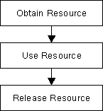

### 5. Smart Pointers

#### Resource Acquisition is Initialization

"new" and "delete" in C++ are extensions of "malloc" and "free," with the added functionality of invoking constructors and destructors. **While offering flexibility, they require careful management of memory ownership to prevent leaks. To address this, C++ employs the RAII (Resource Acquisition Is Initialization) idiom**, introduced by Bjarne Stroustrup. RAII involves wrapping resources like memory, files, or network connections in management classes, ensuring resources are properly handled through constructors and destructors, and providing controlled access via defined interfaces. This paradigm is widely used and forms the basis for tools like smart pointers.

##### Error-prone memory management with `new` and `delete`

In the previous chapters, we have seen that memory management on the heap using `malloc`/`free` or `new`/`delete` is extremely powerful, as they allow for a fine-grained control over the precious memory resource. However, the correct use of these concepts requires some degree of skill and experience (and concentration) from the programmer. If they are not handled correctly, bugs will quickly be introduced into the code. A major source of error is that the details around memory management with `new`/`delete` are completely left to the programer. In the remainder of this lesson, the pair `malloc`/`free` will be omitted for reasons of brevity. However, many of the aspects that hold for `new`/`delete` will also apply to `malloc`/`free`.

Let us take a look at some of the worst problems with `new` and `delete`:

1. **Proper pairing of new and delete** : Every dynamically allocated object that is created with new must be followed by a manual deallocation at a "proper" place in the program. If the programer forgets to call delete (which can happen very quickly) or if it is done at an "inappropriate" position, memory leaks will occur which might clog up a large portion of memory.
2. **Correct operator pairing** : C++ offers a variety of `new`/`delete` operators, especially when dealing with arrays on the heap. A dynamically allocated array initialized with `new[]` may only be deleted with the operator `delete[]`. If the wrong operator is used, program behavior will be undefined - which is to be avoided at all cost in C++.
3. **Memory ownership** : If a third-party function returns a pointer to a data structure, the only way of knowing who will be responsible for resource deallocation is by looking into either the code or the documentation. If both are not available (as is often the case), there is no way to infer the ownership from the return type. As an example, in the final project of this course, we will use the graphical library wxWidgets to create the user interface of a chatbot application. In wxWidgets, the programmer can create child windows and control elements on the heap using `new`, but the framework will take care of deletion altogether. If for some reason the programmer does not know this, he or she might call delete and thus interfere with the inner workings of the wxWidgets library.


##### The benefits of smart pointers

To put it briefly: Smart pointers were introduced in C++ to solve the above mentioned problems by providing a degree of automatic memory management: When a smart pointer is no longer needed (which is the case as soon as it goes out of scope), the memory to which it points is automatically deallocated. When contrasted with smart pointers, the conventional pointers we have seen so far are often termed "raw pointers".

In essence, smart pointers are classes that are wrapped around raw pointers. By overloading the `->` and `*` operators, smart pointer objects make sure that the memory to which their internal raw pointer refers to is properly deallocated. This makes it possible to use smart pointers with the same syntax as raw pointers. As soon as a smart pointer goes out of scope, its destructor is called and the block of memory to which the internal raw pointer refers is properly deallocated. This technique of wrapping a management class around a resource has been conceived by Bjarne Stroustroup and is called **Resource Acquisition Is Initialization (RAII)**. Before we continue with smart pointers and their usage let us take a close look at this powerful concept.


##### Resource Acquisition Is Initialization

The RAII is a widespread programming paradigm, that can be used to protect a resource such as a file stream, a network connection or a block of memory which need proper management.

###### Acquiring and releasing resources

In most programs of reasonable size, there will be many situations where a certain action at some point will necessitate a proper reaction at another point, such as:

1. Allocating memory with `new` or `malloc`, which must be matched with a call to `delete` or `free`.
2. Opening a file or network connection, which must be closed again after the content has been read or written.
3. Protecting synchronization primitives such as atomic operations, memory barriers, monitors or critical sections, which must be released to allow other threads to obtain them.

The following table gives a brief overview of some resources and their respective allocation and deallocation calls in C++:


###### The problem of reliable resource release

A general usage pattern common to the above examples looks like the following:



However, there are several problems with this seemingly simple pattern:

1. The **program might throw an exception** during resource use and thus **the point of release might never be reached**.
2. There might be **several points** where the resource could potentially be released, making it hard for a programmer to keep track of all eventualities.
3. We might **simply forget to release the resource again.**

###### RAII to the rescue

The major idea of RAII revolves around object ownership and information hiding: Allocation and deallocation are hidden within the management class, so a programmer using the class does not have to worry about memory management responsibilities. If he has not directly allocated a resource, he will not need to directly deallocate it - whoever owns a resource deals with it. In the case of RAII this is the management class around the protected resource. The overall goal is to have allocation and deallocation (e.g. with `new` and `delete`) disappear from the surface level of the code you write.

RAII can be used to leverage - among others - the following **advantages**:

- Use class **destructors to perform resource clean-up tasks** such as proper memory deallocation when the RAII object gets out of scope
- Manage ownership and **lifetime of dynamically** allocated objects
- Implement **encapsulation** and information **hiding** due to **resource acquisition and release** being performed within the same object.

In the following, let us look at RAII from the perspective of memory management. There are three major parts to an RAII class:

1. A **resource is allocated in the constructor** of the RAII class
2. The **resource is deallocated in the destructor**
3. All instances of the **RAII class are allocated on the stack to reliably control the lifetime via the object scope**

Let us now take a look at the code example on the below.

```cpp
int main() {
  double den[] = {1.0, 2.0, 3.0, 4.0, 5.0};
  for (size_t i = 0; i < 5; ++i) {
    // allocate the resource on the heap
    double *en = new double(i);

    // use the resource
    std::cout << *en << "/" << den[i] << " = " << *en / den[i] << std::endl;

    // deallocate the resource
    delete en;
  }

  return 0;
}
```

At the beginning of the program, an array of double values `den` is allocated on the stack. Within the loop, a new double is created on the heap using `new`. Then, the result of a division is printed to the console. At the end of the loop, `delete` is called to properly deallocate the heap memory to which `en` is pointing. Even though this code is working as it is supposed to, it is very easy to forget to call `delete` at the end. Let us therefore use the principles of RAII to create a management class that calls delete automatically:

```cpp
class MyInt
{
    int *_p; // pointer to heap data
public:
    MyInt(int *p = NULL) { _p = p; }
    ~MyInt() 
    { 
        std::cout << "resource " << *_p << " deallocated" << std::endl;
        delete _p; 
    }
    int &operator*() { return *_p; } // // overload dereferencing operator
};
```

In this example, the constructor of class `MyInt` takes a pointer to a memory resource. When the destructor of a `MyInt` object is called, the resource is deleted from memory - which makes `MyInt` an RAII memory management class. Also, the `*` operator is overloaded which enables us to dereference `MyInt` objects in the same manner as with raw pointers. Let us therefore slightly alter our code example from above to see how we can properly use this new construct:

```cpp
int main()
{
    double den[] = {1.0, 2.0, 3.0, 4.0, 5.0};
    for (size_t I = 0; I < 5; ++i)
    {
        // allocate the resource on the stack
        MyInt en(new int(i));

        // use the resource
        std::cout << *en << "/" << den[i] << " = " << *en / den[i] << std::endl;
    }

    return 0;
}
```

Update the code on the below with the snippets above before proceeding.

```cpp
class MyInt
{
    int *_p; // pointer to heap data
public:
    MyInt(int *p = NULL) { _p = p; }
    ~MyInt() 
    { 
        std::cout << "resource " << *_p << " deallocated" << std::endl;
        delete _p; 
    }
    int &operator*() { return *_p; } // // overload dereferencing operator
};

int main()
{
    double den[] = {1.0, 2.0, 3.0, 4.0, 5.0};
    for (size_t I = 0; I < 5; ++i)
    {
        // allocate the resource on the stack
        MyInt en(new int(i));

        // use the resource
        std::cout << *en << "/" << den[i] << " = " << *en / den[i] << std::endl;
    }

    return 0;
}
```

Let us break down the resource allocation part in two steps:

1. The part `new int(i)` creates a new block of memory on the heap and initializes it with the value of `i`. The returned result is the address of the block of memory.
2. The part `MyInt en(…)`calls the constructor of class `MyInt`, passing the address of a valid memory block as a parameter.

After creating an object of class `MyInt` on the stack, which, internally, created an integer on the heap, we can use the dereference operator in the same manner as before to retrieve the value to which the internal raw pointer is pointing. Because the `MyInt` object `en` lives on the stack, it is automatically deallocated after each loop cycle - which automatically calls the destructor to release the heap memory. The following console output verifies this:

```
0/1 = 0
resource 0 deallocated
1/2 = 0.5
resource 1 deallocated
2/3 = 0.666667
resource 2 deallocated
3/4 = 0.75
resource 3 deallocated
4/5 = 0.8
resource 4 deallocated
```

We have thus successfully used the RAII idiom to create a memory management class that spares us from thinking about calling delete. By creating the `MyInt` object on the stack, we ensure that the deallocation occurs as soon as the object goes out of scope.


###### Summary

In this section, we have effectively implemented **a concept similar to smart pointers** **using the RAII** paradigm, **removing the programmer's responsibility of manually pairing `new` and `delete` by encapsulating it within a class**. This approach mirrors the functionality of real smart pointers in C++11, which handle memory management automatically along with other features.


#### Smart Pointers

In this section, we will explore **smart pointers in C++11**, which **address common issues** with pointers and memory management, **such as memory leaks and dangling pointers**, **by automating memory deallocation**. Unlike languages like Java that use garbage collection, **C++11 introduces smart pointers, which wrap resources, allocate memory upon construction, and automatically deallocate it when the object goes out of scope, following the RAII** (Resource Allocation Is Initialization) principle. We will examine examples of this concept, discuss the properties of different types of smart pointers (**unique_ptr**, **shared_ptr**, and **weak_ptr**), and **provide guidelines on when to use them versus traditional raw pointers.**

##### RAII and smart pointers

In the last section, we have discussed the powerful **RAII** idiom, which **reduces the risk of improperly managed resources**. Applied to the concept of memory management, **RAII enables us to encapsulate `new` and `delete` calls within a class** and thus present the programmer with a clean interface to the resource he intends to use. Since C++11, there exists a language feature called ***smart pointers*, which builds on the concept of RAII** and - without exaggeration - **revolutionizes the way we use resources on the heap**. Let’s take a look.

##### Smart pointer overview

Since C++11, the standard library includes ***smart pointers***, which **help to ensure that programs are free of memory leaks** while also **remaining exception-safe**. With smart pointers, **resource acquisition occurs at the same time that the object is initialized** (when instantiated with `make_shared` or `make_unique`), so that all resources for the **object are created and initialized in a single line of code**.

In modern C++, raw pointers managed with `new` and `delete` should only be used in small blocks of code with limited scope, where performance is critical (such as with `placement new`) and ownership rights of the memory resource are clear. We will look at some guidelines on where to use which pointer later.

C++11 has introduced **three types of smart pointers**, which are **defined in the header of the standard library**:

1. The **unique pointer** `std::unique_ptr` is a smart pointer which **exclusively owns a dynamically allocated resource on the heap**. There must **not be a second unique pointer to the same resource**.
2. The **shared pointer** `std::shared_ptr` **points to a heap resource but does not explicitly own it**. There may even be several **shared pointers to the same resource**, **each of which will increase an internal reference count**. **As soon as this count reaches zero, the resource will automatically be deallocated**.
3. The **weak pointer** `std::weak_ptr` behaves **similar to the shared pointer** but **does not increase the reference counter.**

Prior to C++11, there was a concept called `std::auto_ptr`, which tried to realize a similar idea. However, this concept can now be safely considered as **deprecated** and should not be used anymore.

Let us now look at each of the three smart pointer types in detail.

##### The Unique pointer

A unique pointer is the **exclusive owner of the memory resource** it represents. There must **not be a second unique pointer to the same memory resource**, otherwise there will be a compiler error. **As soon as the unique pointer goes out of scope, the memory resource is deallocated again**. **Unique pointers are useful when working with a temporary heap resource** that is no longer needed once it goes out of scope.

The following diagram illustrates the basic idea of a unique pointer:


In the example, a resource in memory is referenced by a **unique pointer** instance `sourcePtr`. Then, the resource is **reassigned to another unique pointer** instance `destPtr` using `std::move`. The resource is now owned by `destPtr` while `sourcePtr` can still be used but does not manage a resource anymore.

A unique pointer is constructed using the following syntax:

```cpp
std::unique_ptr<Type> p(new Type);
```


In the example on the below we will see **how a unique pointer is constructed and how it compares to a raw pointer.**

```cpp
#include <memory>

void RawPointer()
{
    int *raw = new int; // create a raw pointer on the heap
    *raw = 1; // assign a value
    delete raw; // delete the resource again
}

void UniquePointer()
{
    std::unique_ptr<int> unique(new int); // create a unique pointer on the stack
    *unique = 2; // assign a value
    // delete is not neccessary
}
```

The function `RawPointer` contains the familiar steps of (1) **allocating memory on the heap with new** and **storing the address in a pointer variable**, (2) **assigning a value to the memory block** using the dereferencing operator `*` and (3) **finally deleting the resource on the heap**. As we already know, **forgetting to call delete will result in a memory leak.**

The function `UniquePointer` shows how to achieve the same goal using a smart pointer from the standard library. As can be seen, **a smart pointer is a class template** that is **declared on the stack** and **then initialized by a raw pointer** (returned by `new` ) **to a heap-allocated object**. **The smart pointer is now responsible for deleting the memory that the raw pointer specifies** - which happens as soon as the smart pointer goes out of scope. Note that **smart pointers always need to be declared on the stack,** **otherwise the scoping mechanism would not work.**

The **smart pointer destructor contains the call to delete**, and because the **smart pointer is declared on the stack**, its **destructor is invoked when the smart pointer goes out of scope**, **even if an exception is thrown**.

In the example now on the below, we will construct a unique pointer to a custom class. Also, we will see how the standard `->` and `*` operators can be used to access member functions of the managed object, just as we would with a raw pointer:

```cpp
#include <iostream>
#include <memory>
#include <string>

class MyClass {
 private:
  // Define a private string member to hold text
  std::string _text;

 public:
  // Default constructor
  MyClass() {};

  // Constructor that initializes the text
  MyClass(std::string text) { _text = text; };

  // Destructor that prints a message when the object is destroyed
  ~MyClass() { std::cout << _text << " destroyed" << std::endl; };

  // Member function to set the text
  void setText(std::string text) { _text = text; };
};

int main() {
  // Create a unique pointer (myClass1) to an instance of MyClass using
  // the default constructor
  // Create another unique pointer (myClass2) to an instance of MyClass
  // using the parameterized constructor
  std::unique_ptr<MyClass> myClass1(new MyClass());
  std::unique_ptr<MyClass> myClass2(new MyClass("String 2"));

  // Use the -> operator to call setText on myClass1 and set its text to
  // "String 1"
  myClass1->setText("String 1");

  // Use the dereference operator * to copy the contents of myClass2 into
  // myClass1
  *myClass1 = *myClass2;

  // Use the .get() function to retrieve raw pointers to the objects
  // managed by myClass1 and myClass2
  // Print the raw pointer addresses to the console
  std::cout << "Objects have heap addresses " << myClass1.get() << " and "
            << myClass2.get() << std::endl;
  return 0;
}
```

Note that the custom class `MyClass` has **two constructors**, **one without arguments** and **one with a string to be passed**, which initializes a member variable `_text` that lives on the stack. Also, once an object of this class gets destroyed, a message to the console is printed, along with the value of `_text`. In `main`, **two unique pointers are created with the address of a `MyClass` object on the heap as arguments**. With `myClass2`, we can see that constructor arguments can be passed just as we would with raw pointers. After both pointers have been created, we can use the `->` operator to access members of the class, such as calling the function `setText`. From looking at the function call alone you would not be able to tell that `myClass1` is in fact a smart pointer. Also, we can use the dereference operator `*` to access the value of `myClass1` and `myClass2` and assign the one to the other. Finally, the `.` operator gives us access to **proprietary functions of the smart pointer**, such as retrieving the internal raw pointer with `get()`.

The console output of the program looks like the following:

```bash
Objects have heap addresses 0x1004000e0 and 0x100400100
String 2 destroyed
String 2 destroyed
```

Obviously, both pointers have different addresses on the stack, even after copying the contents from `myClass2` to `myClass1`. As can be seen from the last two lines of the output, the destructor of both objects gets called automatically at the end of the program and - as expected - **the value of the internal string is identical due to the copy operation.**

Summing up, the **unique pointer** allows **a single owner of the underlying internal raw pointer**. **Unique pointers should be the default** choice **unless you know for certain that sharing is required at a later stage**. We have already seen **how to transfer ownership of a resource using the Rule of Five and move semantics**. Internally, the unique pointer uses this very concept along with RAII to encapsulate a resource (the raw pointer) and transfer it between pointer objects when either the move assignment operator or the move constructor are called. Also, **a key feature of a unique pointer**, which makes it so **well-suited as a return type for many functions**, is the **possibility to convert it to a shared pointer**. We will have a deeper look into this in the section on ownership transfer.

##### The Shared Pointer

Just as the unique pointer, a **shared pointer** **owns the resource it points to**. The **main difference** between the two smart pointers is that **shared pointers keep a reference counter** on **how many of them point to the same memory resource**. **Each time a shared pointer goes out of scope**, **the counter is decreased**. **When it reaches zero** (i.e. when the **last shared pointer** to the resource is about to vanish). the **memory is properly deallocated**. This smart pointer type is **useful for cases** where you require **access to a memory location on the heap in multiple parts of your program** and you want to make sure that whoever owns a shared pointer to the memory can rely on the fact that it will be accessible throughout the lifetime of that pointer.

The following diagram illustrates the basic idea of a shared pointer:


Please take a look at the code on the below.

```cpp
#include <iostream>
#include <memory>

int main() {
  std::shared_ptr<int> shared1(new int);
  std::cout << "shared pointer count = " << shared1.use_count() << std::endl;
  {
    std::shared_ptr<int> shared2 = shared1;
    std::cout << "shared pointer count = " << shared2.use_count() << std::endl;
  }
  std::cout << "shared pointer count = " << shared1.use_count() << std::endl;
  return 0;
}
```

We can see that **shared pointers are constructed just as unique pointers are**. Also, we can **access the internal reference count by using the method `use_count()`**. In the inner block, **a second shared pointer `shared2` is created and `shared1` is assigned to it**. In the **copy constructor**, the **internal resource pointer is copied to `shared2`** and the **resource counter is incremented in both `shared1` and `shared2`**. Let us take a look at the output of the code:

```
shared pointer count = 1
shared pointer count = 2
shared pointer count = 1
```

You may have noticed that the lifetime of **`shared2` is limited to the scope denoted by the enclosing curly brackets**. Thus, once this scope is left and `shared2` is destroyed, **the reference counter in `shared1` is decremented by one** - which is reflected in the three console outputs given above.

**A shared pointer can also be redirected by using the `reset()` function**. If the resource which a shared pointer manages is no longer needed in the current scope, the pointer can be reset to manage a difference resource as illustrated in the example on the below.

```cpp
#include <iostream>
#include <memory>

class MyClass {
 public:
  ~MyClass() { std::cout << "Destructor of MyClass called" << std::endl; }
};

int main() {
  std::shared_ptr<MyClass> shared(new MyClass);
  std::cout << "shared pointer count = " << shared.use_count() << std::endl;

  shared.reset(new MyClass);
  std::cout << "shared pointer count = " << shared.use_count() << std::endl;
}
```

Note that in the example, the destructor of MyClass prints a string to the console when called. The output of the program looks like the following:

```
shared pointer count = 1
Destructor of MyClass called
shared pointer count = 1
Destructor of MyClass called
```

After creation, the program prints `1` as the reference count of `shared`. Then, the `reset` function is called with a new instance of `MyClass` as an argument. This causes the destructor of the first `MyClass` instance to be called, hence the console output. As can be seen, the reference count of the shared pointer is still at `1`. Then, at the end of the program, the destructor of the second `MyClass` object is called once the path of execution leaves the scope of `main.`

Despite all the advantages of shared pointers, it is still possible to have problems with memory management though. Consider the scenario on the below.

```cpp
#include <iostream>
#include <memory>

class MyClass
{
public:
    std::shared_ptr<MyClass> _member;
    ~MyClass() { std::cout << "Destructor of MyClass called" << std::endl; }
};

int main()
{
    std::shared_ptr<MyClass> myClass1(new MyClass);
    std::shared_ptr<MyClass> myClass2(new MyClass);
    
    myClass1->_member = myClass2;
    myClass2->_member = myClass1;

    return 0;
}
```

In main, two shared pointers `myClass1` and `myClass2` which are managing objects of type `MyClass` are allocated on the stack. As can be seen from the console output, both smart pointers are automatically deallocated when the scope of main ends:

```
Destructor of MyClass called
Destructor of MyClass called
```

When the following two lines are added to main, the result is quite different:

```
myClass1->_member = myClass2;
myClass2->_member = myClass1;
```

These two lines produce a ***circular reference***. When `myClass1` goes out of scope at the end of main, its destructor can’t clean up memory as there is still a reference count of 1 in the smart pointer, which is caused by the shared pointer _member in `myClass2`. The same holds true for `myClass2`, which can not be properly deleted as there is still a shared pointer to it in `myClass1`. This deadlock situation prevents the destructors from being called and causes a memory leak. When we use *Valgrind* on this program, we get the following summary:

```
==20360== LEAK SUMMARY:
==20360==    definitely lost: 16 bytes in 1 blocks
==20360==    indirectly lost: 80 bytes in 3 blocks
==20360==      possibly lost: 72 bytes in 3 blocks
==20360==    still reachable: 200 bytes in 6 blocks
==20360==         suppressed: 18,985 bytes in 160 blocks
```

As can be seen, the memory leak is clearly visible with 16 bytes being marked as "definitely lost". To prevent such circular references, there is a third smart pointer, which we will look at in the following.

##### The Weak Pointer

**Similar to shared pointers, there can be multiple weak pointers to the same resource**. The **main difference** though is that **weak pointers do not increase the reference count**. Weak pointers hold a non-owning reference to an object that is managed by another shared pointer.

The following rule applies to weak pointers: **You can only create weak pointers out of shared pointers or out of another weak pointer.** The code on the below shows a few examples of how to use and how not to use weak pointers.

```cpp
#include <iostream>
#include <memory>

int main() {
  std::shared_ptr<int> mySharedPtr(new int);
  std::cout << "shared pointer count = " << mySharedPtr.use_count()
            << std::endl;

  std::weak_ptr<int> myWeakPtr1(mySharedPtr);
  std::weak_ptr<int> myWeakPtr2(myWeakPtr1);
  std::cout << "shared pointer count = " << mySharedPtr.use_count()
            << std::endl;
  // std::weak_ptr<int> myWeakPtr3(new int); // COMPILE ERROR
}
```

The output looks as follows:

```
shared pointer count = 1
shared pointer count = 1
```

First, a shared pointer to an integer is created with a reference count of 1 after creation. Then, two weak pointers to the integer resource are created, the first directly from the shared pointer and the second indirectly from the first weak pointer. As can be seen from the output, neither of both weak pointers increased the reference count. At the end of main, the attempt to directly create a weak pointer to an integer resource would lead to a compile error.

As we have seen with **raw pointers**, you can **never be sure wether the memory resource to which the pointer refers is still valid**. With a weak pointer, even though this type does not prevent an object from being deleted, the **validity of its resource can be checked**. The code on the below illustrates how to use the `expired()` function to do this.

```cpp
#include <iostream>
#include <memory>

int main() {
  std::shared_ptr<int> mySharedPtr(new int);
  std::weak_ptr<int> myWeakPtr(mySharedPtr);

  mySharedPtr.reset(new int);
  if (myWeakPtr.expired() == true) {
    std::cout << "Weak pointer expired." << std::endl;
  }
}
```

Thus, with smart pointers, there will **always be a managing instance which is responsible for the proper allocation and deallocation** of a resource. In some cases it might be necessary to convert from one smart pointer type to another. Let us take a look at the set of possible conversions in the following.

##### Converting between smart pointers

The example on the below illustrates how to convert between the different pointer types.

```cpp
#include <iostream>
#include <memory>

int main() {
  // construct a unique pointer
  std::unique_ptr<int> uniquePtr(new int);

  // (1) shared pointer from unique pointer
  std::shared_ptr<int> sharedPtr1 = std::move(uniquePtr);

  // (2) shared pointer from weak pointer
  std::weak_ptr<int> weakPtr(sharedPtr1);
  std::shared_ptr<int> sharedPtr2 = weakPtr.lock();

  // (3) raw pointer from shared (or unique) pointer
  int *rawPtr = sharedPtr2.get();
  delete rawPtr;

  return 0;
}
```

In (1), a conversion from **unique pointer to shared pointer** is performed. You can see that this can be achieved by using `std::move`, which calls the move assignment operator on `sharedPtr1` and steals the resource from `uniquePtr` while at the same time invalidating its resource handle on the heap-allocated integer.

In (2), you can see how to convert **from weak to shared pointer**. Imagine that you have been passed a weak pointer to a memory object which you want to work on. To avoid invalid memory access, you want to make sure that the object will not be deallocated before your work on it has been finished. To do this, you can convert a weak pointer to a shared pointer by calling the `lock()` function on the weak pointer.

In (3), a **raw pointer is extracted** from a shared pointer. However, this operation does not decrease the reference count within `sharedPtr2`. This means that calling `delete` on `rawPtr` in the last line before main returns will generate a runtime error as a resource is trying to be deleted which is managed by `sharedPtr2` and has already been removed. The output of the program when compiled with `g++` thus is: `malloc: *** error for object 0x1003001f0: pointer being freed was not allocated`.


Note that there are **no options for converting away from a shared pointer**. Once you have created a shared pointer, you must stick to it (or a copy of it) for the remainder of your program.

## When to use raw pointers and smart pointers?

As a general rule of thumb with modern C++, smart pointers should be used often. They will make your code safer as you no longer need to think (much) about the proper allocation and deallocation of memory. As a consequence, there will be much fewer memory leaks caused by dangling pointers or crashes from accessing invalidated memory blocks.

When using raw pointers on the other hand, your code might be susceptible to the following bugs:

1. Memory leaks
2. Freeing memory that shouldn’t be freed
3. Freeing memory incorrectly
4. Using memory that has not yet been allocated
5. Thinking that memory is still allocated after being freed

With all the advantages of smart pointers in modern C++, one could easily assume that it would be best to completely ban the use of new and delete from your code. However, while this is in many cases possible, it is not always advisable as well. Let us take a look at the [C++ core guidelines](http://isocpp.github.io/CppCoreGuidelines/CppCoreGuidelines#main), which has several [**rules for explicit memory allocation and deallocation**](http://isocpp.github.io/CppCoreGuidelines/CppCoreGuidelines#r-resource-management). In the scope of this course, we will briefly discuss three of them:

1. **R. 10: Avoid malloc and free** While the calls `(MyClass*)malloc( sizeof(MyClass) )` and `new MyClass` both allocate a block of memory on the heap in a perfectly valid manner, only `new` will also call the constructor of the class and `free` the destructor. To reduce the risk of undefined behavior, `malloc` and `free` should thus be avoided.
2. **R. 11: Avoid calling new and delete explicitly** Programmers have to make sure that every call of `new` is paired with the appropriate `delete` at the correct position so that no memory leak or invalid memory access occur. The emphasis here lies in the word "explicitly" as opposed to implicitly, such as with smart pointers or containers in the standard template library.
3. **R. 12: Immediately give the result of an explicit resource allocation to a manager object** It is recommended to make use of manager objects for controlling resources such as files, memory or network connections to mitigate the risk of memory leaks. This is the core idea of smart pointers as discussed at length in this section.

Summarizing, raw pointers created with `new` and `delete` allow for a high degree of flexibility and control over the managed memory as we have seen in earlier lessons of this course. To mitigate their proneness to errors, the following additional recommendations can be given:

- A call to `new` should not be located too far away from the corresponding `delete`. It is bad style to stretch you `new` / `delete` pairs throughout your program with references criss-crossing your entire code.
- Calls to `new` and `delete` should always be hidden from third parties so that they must not concern themselves with managing memory manually (which is similar to R. 12).


